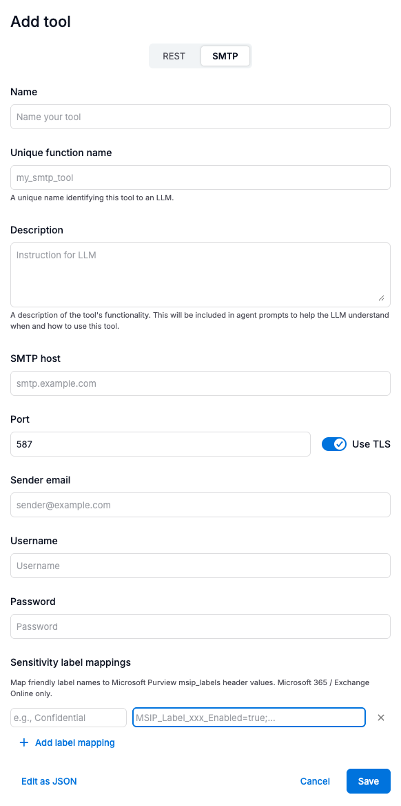
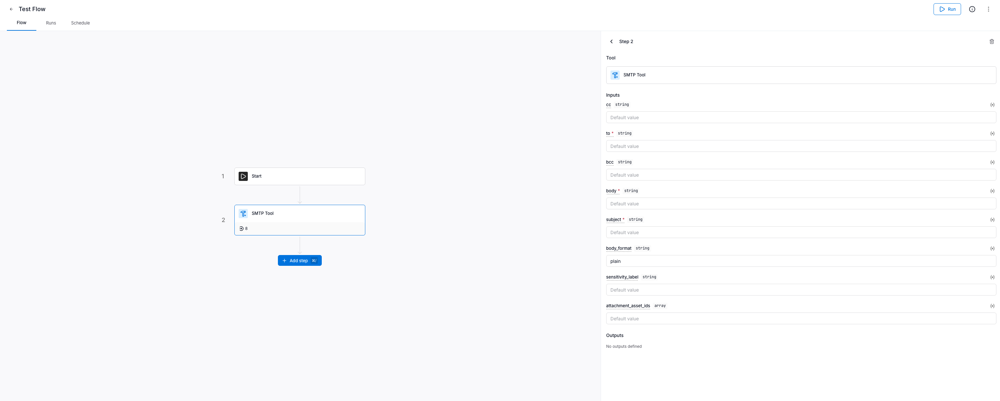

import {Steps, Aside, Tabs, TabItem} from '@astrojs/starlight/components'

Custom tools let you extend agents beyond the built-in catalog capabilities.
Agent Studio supports two types of custom tools: **SMTP tools** for sending emails and **HTTP tools** for calling external REST APIs.

<Aside type="tip">
For a high-level overview of tools and how agents use them, see [Tools](/agent-studio-docs/build/tools/overview/).
</Aside>

## SMTP tools

SMTP tools enable agents to send emails via an SMTP server. Common use cases include:
- Sending notification or alert emails
- Distributing reports with chart attachments
- Automated communications triggered by agent flows

### Configuration

SMTP tools require three pieces of configuration:

| Component | Description |
|-----------|-------------|
| **SMTP config** | Server hostname, port, TLS setting, and sender email address |
| **Auth config** | Credentials for authenticating with the SMTP server |
| **Tool metadata** | Display name, description, and a unique function name |

### Creating an SMTP tool

<Steps>
1. **Open the tool creation form**

   In Agent Studio, go to **Tools** and click **Add tool**. Select the **SMTP** tab.

2. **Fill in the tool details**

   | Field | Description | Example |
   |-------|-------------|---------|
   | **Name** | A display name for the tool | `Email Sender` |
   | **Unique function name** | A unique identifier for the LLM | `send_email` |
   | **Description** | Helps the LLM understand when to use this tool | `Send email notifications to recipients` |
   | **SMTP Host** | Your SMTP server hostname | `smtp.yourprovider.com` |
   | **Port** | SMTP port (typically 587 for STARTTLS) | `587` |
   | **Use STARTTLS** | Enable TLS encryption | `true` |
   | **Sender email** | The "From" address for outgoing emails | `notifications@yourcompany.com` |
   | **Username** | SMTP username | *(from your email provider)* |
   | **Password** | SMTP password or API key | *(from your email provider)* |

3. **Save and test**

   Click **Save**, then select the tool and click **Run tool** to verify the configuration with test inputs.

4. **Assign the tool to an agent**

   When creating or editing an agent, add the tool from the agent's tool configuration panel.
</Steps>

<Aside type="tip">
You can also use the **Edit as JSON** button at the bottom of the tool form to paste a complete JSON configuration directly. This is useful when sharing tool configs between environments.
</Aside>

### SMTP configuration fields

| Field | Type | Default | Description |
|-------|------|---------|-------------|
| `host` | string | required | SMTP server hostname |
| `port` | integer | `587` | SMTP server port (1--65535) |
| `use_starttls` | boolean | `true` | Whether to use STARTTLS encryption |
| `sender_email` | string | required | The "From" address for outgoing emails |

### Common SMTP providers

| Provider | Host | Port | Username |
|----------|------|------|----------|
| SendGrid | `smtp.sendgrid.net` | 587 | `apikey` (API key as password) |
| AWS SES | `email-smtp.{region}.amazonaws.com` | 587 | IAM SMTP credentials |
| Gmail | `smtp.gmail.com` | 587 | Email address (app password required) |
| Mailgun | `smtp.mailgun.org` | 587 | `postmaster@your-domain.mailgun.org` |

<Aside type="caution" title="Microsoft 365">
Microsoft 365 (`smtp.office365.com`) has deprecated SMTP Basic Authentication tenant-wide.
Use [OAuth 2.0 authentication](#microsoft-365-oauth-smtp) instead, or see the [Sending email via Microsoft Graph API](#example-sending-email-via-microsoft-graph-api) section for an HTTP-based alternative.
</Aside>

### Tool inputs at runtime

When an agent calls the SMTP tool, it provides the following parameters:

| Parameter | Type | Required | Description |
|-----------|------|----------|-------------|
| `to` | string or list | Yes | Recipient email address(es) |
| `subject` | string | Yes | Email subject line |
| `body` | string | Yes | Email body content (plain text or HTML) |
| `body_format` | string | No | `"plain"` (default) or `"html"` |
| `attachment_asset_ids` | list | No | Asset IDs to attach to the email |
| `cc` | string or list | No | CC recipient(s) |
| `bcc` | string or list | No | BCC recipient(s) |

### Microsoft 365 OAuth SMTP

Microsoft 365 has deprecated SMTP Basic Authentication. To send emails via `smtp.office365.com`, configure OAuth 2.0 Client Credentials authentication.

<Aside type="note" title="Microsoft 365 only">
OAuth SMTP is currently only supported for Microsoft 365 / Exchange Online.
Other providers (Gmail, SendGrid, etc.) should use Basic authentication or API keys.
</Aside>

#### Prerequisites

Before configuring the SMTP tool, an Azure AD administrator must:

1. **Create an Entra (Azure AD) app registration**
2. **Create an Exchange service principal** for the app
3. **Assign the SMTP.SendAsApp role** with a scoped sender group
4. **Enable SMTP AUTH** for the sender mailbox

<Aside type="caution">
These steps require **Exchange Administrator** role in Microsoft 365.
Without this role, the required PowerShell cmdlets will not be available.
</Aside>

#### Azure AD setup summary

<Steps>
1. **Create the app registration**

   In the [Microsoft Entra admin center](https://entra.microsoft.com):
   - Go to **Identity** → **Applications** → **App registrations** → **New registration**
   - Name: e.g., `Alation SMTP OAuth`
   - Supported account types: **Single tenant**
   - Leave Redirect URI blank (not needed for client credentials flow)

2. **Create a client secret**

   In the app registration:
   - Go to **Certificates & secrets** → **Client secrets** → **New client secret**
   - Copy the secret value immediately — you'll need it for Agent Studio

3. **Find the Enterprise Application Object ID**

   Using Microsoft Graph PowerShell:
   ```powershell
   Connect-MgGraph -Scopes "Application.Read.All"
   Get-MgServicePrincipal -Filter "appId eq '<CLIENT_ID>'" |
     Format-List DisplayName,AppId,Id
   ```
   The `Id` value is the **Enterprise Application Object ID** (different from the App Registration Object ID).

4. **Create the Exchange service principal**

   ```powershell
   Connect-ExchangeOnline -UserPrincipalName "admin@yourdomain.com"
   New-ServicePrincipal `
     -AppId "<CLIENT_ID>" `
     -ObjectId "<ENTERPRISE_APP_OBJECT_ID>" `
     -DisplayName "Alation SMTP OAuth"
   ```

5. **Create a scoped sender group**

   ```powershell
   New-DistributionGroup -Name "Alation SMTP Senders" -Type Security
   Add-DistributionGroupMember -Identity "Alation SMTP Senders" `
     -Member "sender@yourdomain.com"
   ```

6. **Create a management scope and assign the role**

   ```powershell
   $groupDn = (Get-DistributionGroup "Alation SMTP Senders").DistinguishedName
   New-ManagementScope -Name "Alation SMTP Scope" `
     -RecipientRestrictionFilter "MemberOfGroup -eq '$groupDn'"
   New-ManagementRoleAssignment -Name "Alation SMTP SendAsApp" `
     -Role "Application SMTP.SendAsApp" `
     -App "<CLIENT_ID>" `
     -CustomResourceScope "Alation SMTP Scope"
   ```

7. **Enable SMTP AUTH for the sender mailbox**

   ```powershell
   Set-CASMailbox -Identity "sender@yourdomain.com" `
     -SmtpClientAuthenticationDisabled $false
   ```

8. **Validate the setup**

   ```powershell
   Test-ServicePrincipalAuthorization `
     -Identity "<CLIENT_ID>" `
     -Resource "sender@yourdomain.com"
   ```
   Expected: `InScope : True`
</Steps>

#### Agent Studio configuration

Once the Azure AD setup is complete, configure the SMTP tool in Agent Studio:

| Field | Value |
|-------|-------|
| **SMTP Host** | `smtp.office365.com` |
| **Port** | `587` |
| **Use TLS** | Enabled |
| **Sender email** | The mailbox email (must be in the scoped sender group) |
| **Authentication method** | `OAuth 2.0 (Microsoft 365 only)` |
| **Token URL** | `https://login.microsoftonline.com/{tenant-id}/oauth2/v2.0/token` |
| **Client ID** | Application (client) ID from the app registration |
| **Client secret** | The secret value created in step 2 |
| **Scopes** | `https://outlook.office365.com/.default` |

<Aside type="tip">
Replace `{tenant-id}` with your Microsoft 365 tenant ID.
Find it in the Azure portal under **Microsoft Entra ID** → **Overview** → **Tenant ID**.
</Aside>

#### Common errors

| Error | Cause | Fix |
|-------|-------|-----|
| `535 5.7.3 Authentication unsuccessful` | Wrong token scope, SMTP AUTH disabled, or invalid credentials | Verify scope is `https://outlook.office365.com/.default`, check mailbox SMTP AUTH is enabled |
| `430 4.2.0 STOREDRV; mailbox logon failure` | App not authorized for sender mailbox | Run `Test-ServicePrincipalAuthorization` to verify `InScope: True` |
| `AuthenticationContext has no rights` | Cached token has old permissions | Wait 5–30 minutes for permission changes to propagate, then edit the SMTP tool in Agent Studio and click **Save** to force a fresh token request |

### Sensitivity labels (Microsoft Purview)

If your organization uses Microsoft 365 with [Microsoft Purview sensitivity labels](https://learn.microsoft.com/en-us/purview/information-protection), you can configure the SMTP tool to stamp outgoing emails with a sensitivity classification.
This allows downstream systems — including Outlook and Exchange Online — to apply data protection policies based on the label.



<Aside type="note" title="Microsoft 365 only">
Sensitivity labels are a Microsoft Purview feature.
On non-Microsoft email infrastructure the `msip_labels` header is ignored.
Existing SMTP tool configurations are not affected.
</Aside>

#### How it works

When the agent sends an email with a `sensitivity_label` value, Agent Studio looks up the corresponding header string in the tool's `sensitivity_label_mappings` config and attaches it as an `msip_labels` MIME header.
Exchange Online reads this header and applies the matching Purview label to the message.

The labels classify the email — they do not encrypt it at send time.
If a label triggers Azure Rights Management (RMS) encryption, that enforcement happens on the Exchange side after the email is received.

#### Admin configuration

An admin must add `sensitivity_label_mappings` to the SMTP tool config.
The keys are the label names the agent will use; the values are the full `msip_labels` header strings from your organization's Microsoft 365 tenant.

```jsonc
{
  "sensitivity_label_mappings": {
    "Public": "MSIP_Label_{guid}_Enabled=true;MSIP_Label_{guid}_SiteId={tenant-id};MSIP_Label_{guid}_SetDate=2024-01-01T00:00:00Z;MSIP_Label_{guid}_Method=Standard;MSIP_Label_{guid}_Name=Public;MSIP_Label_{guid}_ContentBits=0",
    "Confidential": "MSIP_Label_{guid}_Enabled=true;MSIP_Label_{guid}_SiteId={tenant-id};MSIP_Label_{guid}_SetDate=2024-01-01T00:00:00Z;MSIP_Label_{guid}_Method=Standard;MSIP_Label_{guid}_Name=Confidential;MSIP_Label_{guid}_ContentBits=8"
  }
}
```

Replace `{guid}` with the label's GUID and `{tenant-id}` with your Microsoft 365 tenant ID.
Admins can retrieve these values from the [Microsoft Purview compliance portal](https://compliance.microsoft.com) or via PowerShell:

```bash
Connect-IPPSSession
Get-Label | Select DisplayName, Guid
```

<Aside type="caution" title="GUIDs are tenant-specific">
Label GUIDs and tenant IDs vary per Microsoft 365 organization.
Alation cannot provide defaults — these values must come from your organization's Microsoft 365 tenant.
</Aside>

#### Sensitivity label config reference

| Field | Type | Description |
|-------|------|-------------|
| `sensitivity_label_mappings` | object | Optional. Map of label name → full `msip_labels` header string. |

#### Using sensitivity labels in workflows

When adding the SMTP tool as a step in a flow, pass `sensitivity_label` as an input parameter with one of the label names configured in `sensitivity_label_mappings`.



| Parameter | Type | Required | Description |
|-----------|------|----------|-------------|
| `sensitivity_label` | string | No | Label name to apply, e.g. `"Confidential"`. Must match a key in `sensitivity_label_mappings`. |

---

## HTTP tools

HTTP tools enable agents to call external HTTPS endpoints. Common use cases include:
- Calling REST APIs (CRM lookups, ticketing systems, etc.)
- Sending webhook notifications (Slack, Teams, etc.)
- Integrating with cloud services (Microsoft Graph, Google APIs, etc.)

### Configuration

HTTP tools require four pieces of configuration:

| Component | Description |
|-----------|-------------|
| **HTTP config** | URL template, HTTP method, and timeout |
| **Auth config** | Credentials for authenticating with the endpoint |
| **Input parameter schema** | JSON Schema defining the tool's input parameters |
| **Tool metadata** | Display name, description, and a unique function name |

### Creating an HTTP tool

<Steps>
1. **Open the tool creation form**

   In Agent Studio, go to **Tools** and click **Add tool**. Select the **REST** tab.

2. **Fill in the tool details**

   | Field | Description | Example |
   |-------|-------------|---------|
   | **Name** | A display name for the tool | `Customer Lookup` |
   | **Unique function name** | A unique identifier for the LLM | `lookup_customer` |
   | **Description** | Helps the LLM understand when to use this tool | `Look up customer details by ID` |
   | **URL** | HTTPS URL template (use `{param}` for path parameters) | `https://api.example.com/v1/customers/{customer_id}` |
   | **Method** | HTTP method | `GET` |
   | **Timeout (seconds)** | Request timeout (max 60) | `30` |
   | **Authentication method** | How to authenticate with the endpoint | See [Supported authentication types](#supported-authentication-types) |

3. **Add input parameter schema**

   Click **Add input parameter schema** and define the parameters the tool accepts as a JSON Schema. Path parameters in the URL (e.g., `{customer_id}`) must be included and marked as `required`.

   ```json
   {
     "type": "object",
     "properties": {
       "customer_id": {
         "type": "string",
         "description": "Customer ID to look up"
       }
     },
     "required": ["customer_id"]
   }
   ```

4. **Save and test**

   Click **Save**, then select the tool and click **Run tool** to verify the configuration.

5. **Assign the tool to an agent**

   When creating or editing an agent, add the tool from the agent's tool configuration panel.
</Steps>

<Aside type="tip">
You can also use the **Edit as JSON** button at the bottom of the tool form to paste a complete JSON configuration directly.
</Aside>

### HTTP configuration fields

| Field | Type | Default | Description |
|-------|------|---------|-------------|
| `url` | string | required | HTTPS URL template (can include `{param}` placeholders) |
| `method` | string | required | `GET`, `POST`, `PUT`, `PATCH`, or `DELETE` |
| `timeout_seconds` | integer | `30` | Request timeout in seconds (max 60) |

### URL templates

URLs can include path parameters using `{param}` syntax:

```
https://api.example.com/users/{user_id}
https://api.example.com/v1/{resource_type}/{resource_id}
```

**Requirements:**
- Must use HTTPS (HTTP is not allowed)
- Cannot use IP addresses (domain names only)
- Cannot point to localhost or private network ranges
- Path parameters must be defined in `input_parameter_schema` and marked as `required`

### Parameter routing

Parameters are automatically routed based on the HTTP method:

| Method | Path parameters | Remaining parameters |
|--------|----------------|---------------------|
| `GET`, `DELETE` | Substituted into URL | Sent as query string |
| `POST`, `PUT`, `PATCH` | Substituted into URL | Sent as JSON body |

### Supported authentication types

| Auth Type | Use Case | Required Fields |
|-----------|----------|-----------------|
| `NONE` | Public APIs or API key via headers | `custom_headers` (optional) |
| `BASIC` | Username/password | `username`, `password` |
| `CLIENT_CREDENTIALS` | OAuth 2.0 server-to-server | `token_url`, `client_id`, `client_secret`, `scopes` (optional) |
| `AUTHORIZATION_CODE` | OAuth 2.0 user-delegated | `authorization_url`, `token_url`, `client_id`, `client_secret` (optional) |

### Authentication examples

**API key via custom headers**

```json
{
  "name": "API Key Auth",
  "auth_type": "NONE",
  "custom_headers": {
    "X-API-Key": "your-api-key"
  }
}
```

**Basic authentication**

```json
{
  "name": "Basic Auth",
  "auth_type": "BASIC",
  "username": "user",
  "password": "password"
}
```

**OAuth 2.0 Client Credentials**

```json
{
  "name": "OAuth M2M",
  "auth_type": "CLIENT_CREDENTIALS",
  "token_url": "https://auth.example.com/oauth/token",
  "client_id": "your-client-id",
  "client_secret": "your-client-secret",
  "scopes": "api.read api.write"
}
```

<Aside type="note">
When using `CLIENT_CREDENTIALS` auth, Agent Studio automatically fetches and refreshes OAuth tokens. You do not need to manage token lifecycle manually.
</Aside>

---

## Example: Sending email via Microsoft Graph API

Organizations using Microsoft 365 often have SMTP Basic Authentication disabled tenant-wide.
In this case, you can use an **HTTP tool** with the [Microsoft Graph Send Mail API](https://learn.microsoft.com/en-us/graph/api/user-sendmail) to send emails using OAuth 2.0 -- no code changes required.

### Prerequisites

You need an Azure AD app registration with the **Mail.Send** application permission. See the [Microsoft documentation](https://learn.microsoft.com/en-us/entra/identity-platform/quickstart-register-app) for setup instructions.

<Steps>
1. **Register an app in Microsoft Entra ID (Azure AD)**

   - Go to the [Azure portal](https://portal.azure.com) > **Microsoft Entra ID** > **App registrations** > **New registration**
   - Give it a name (e.g., "Alation Agent Studio Email")
   - Set **Supported account types** to "Accounts in this organizational directory only"
   - No redirect URI is needed

2. **Add the Mail.Send permission**

   - In the app registration, go to **API permissions** > **Add a permission**
   - Select **Microsoft Graph** > **Application permissions**
   - Search for and add **Mail.Send**
   - Click **Grant admin consent** (requires an Azure AD admin)

3. **Create a client secret**

   - Go to **Certificates & secrets** > **New client secret**
   - Copy the secret value (it is only shown once)

4. **Note your tenant and client IDs**

   - From the app's **Overview** page, copy the **Application (client) ID** and **Directory (tenant) ID**
</Steps>

### Create the HTTP tool

<Steps>
1. In Agent Studio, go to **Tools** > **Add tool** > **REST** tab.

2. Click **Edit as JSON** at the bottom of the form and paste the following configuration, replacing the placeholder values with your Azure AD app details:

   ```json
   {
     "name": "Send Email (Microsoft 365)",
     "function_name": "send_email_m365",
     "description": "Send an email using Microsoft Graph API. Use this tool to send emails to recipients with a subject and body.",
     "tool_type": "http",
     "auth_config": {
       "name": "Microsoft Graph OAuth",
       "auth_type": "CLIENT_CREDENTIALS",
       "token_url": "https://login.microsoftonline.com/<your-tenant-id>/oauth2/v2.0/token",
       "client_id": "<your-client-id>",
       "client_secret": "<your-client-secret>",
       "scopes": "https://graph.microsoft.com/.default"
     },
     "http_config": {
       "url": "https://graph.microsoft.com/v1.0/users/{sender_user_id}/sendMail",
       "method": "POST",
       "timeout_seconds": 30
     },
     "input_parameter_schema": {
       "type": "object",
       "properties": {
         "sender_user_id": {
           "type": "string",
           "description": "The email address of the sender, e.g. noreply@yourcompany.com"
         },
         "message": {
           "type": "object",
           "description": "The email message to send",
           "properties": {
             "subject": {
               "type": "string",
               "description": "Email subject line"
             },
             "body": {
               "type": "object",
               "description": "Email body",
               "properties": {
                 "contentType": {
                   "type": "string",
                   "description": "Body format: Text or HTML"
                 },
                 "content": {
                   "type": "string",
                   "description": "The email body content"
                 }
               },
               "required": ["contentType", "content"]
             },
             "toRecipients": {
               "type": "array",
               "description": "List of recipients",
               "items": {
                 "type": "object",
                 "properties": {
                   "emailAddress": {
                     "type": "object",
                     "properties": {
                       "address": {
                         "type": "string",
                         "description": "Recipient email address"
                       }
                     },
                     "required": ["address"]
                   }
                 },
                 "required": ["emailAddress"]
               }
             }
           },
           "required": ["subject", "body", "toRecipients"]
         }
       },
       "required": ["sender_user_id", "message"]
     }
   }
   ```

3. Click **Save**, then test the tool with sample inputs.
</Steps>

<Aside type="tip">
The `sender_user_id` path parameter can be set as a **fixed input** on the agent (e.g., `noreply@yourcompany.com`) so the agent does not need to decide which sender to use at runtime. Alternatively, you can hardcode the sender directly in the URL (e.g., `https://graph.microsoft.com/v1.0/users/noreply@yourcompany.com/sendMail`) and remove `sender_user_id` from the schema. See [Tool input configuration](/agent-studio-docs/build/agents/overview/#tool-input-configuration) for details.
</Aside>

### How it works

When an agent calls this tool:

1. Agent Studio uses the `CLIENT_CREDENTIALS` auth config to automatically fetch an OAuth token from `https://login.microsoftonline.com/{tenant}/oauth2/v2.0/token`
2. The token is included as a `Bearer` token in the request to Microsoft Graph
3. The Graph API sends the email on behalf of the specified sender
4. A `202 Accepted` response confirms the email was accepted for delivery

### Microsoft reference documentation

- [Send mail API reference](https://learn.microsoft.com/en-us/graph/api/user-sendmail) -- Full API specification, request body schema, and examples
- [OAuth 2.0 Client Credentials flow](https://learn.microsoft.com/en-us/entra/identity-platform/v2-oauth2-client-creds-grant-flow) -- How to obtain tokens for server-to-server calls
- [Register an application](https://learn.microsoft.com/en-us/entra/identity-platform/quickstart-register-app) -- Step-by-step Azure AD app registration
- [Microsoft Graph permissions reference](https://learn.microsoft.com/en-us/graph/permissions-reference) -- Available application permissions

---

## Troubleshooting

### SMTP tools

| Error | Cause | Solution |
|-------|-------|----------|
| Authentication unsuccessful | Wrong credentials or Basic Auth disabled | Verify username/password. For Microsoft 365, use an HTTP tool with Graph API instead |
| Connection refused | Wrong host or port | Verify SMTP server settings with your email provider |
| TLS handshake error | STARTTLS misconfiguration | Verify port supports STARTTLS (typically port 587) |
| Sender not verified | Unverified sender address | Verify the sender email with your provider |

### HTTP tools

| Error | Cause | Solution |
|-------|-------|----------|
| URL must use HTTPS | HTTP URL provided | Change the URL scheme to `https://` |
| URL cannot use IP addresses | IP address in URL | Use a domain name instead |
| Path parameters not found in schema | Missing schema property | Add the path parameter to `input_parameter_schema` and mark it as `required` |
| 401/403 response | Authentication failure | Verify credentials. For OAuth, check that admin consent has been granted |
| Request timed out | Slow endpoint | Increase `timeout_seconds` (max 60) |

## API reference

| Endpoint | Method | Description |
|----------|--------|-------------|
| `/ai/api/v1/config/tool` | `POST` | Create a tool config |
| `/ai/api/v1/config/tool` | `GET` | List tool configs |
| `/ai/api/v1/config/tool/{id}` | `GET` | Get a tool config |
| `/ai/api/v1/config/tool/{id}` | `PATCH` | Update a tool config |
| `/ai/api/v1/config/tool/{id}` | `DELETE` | Delete a tool config |

For the full API specification, see the [API Reference](https://developer.alation.com/dev/reference/alation-ai-api-overview).
