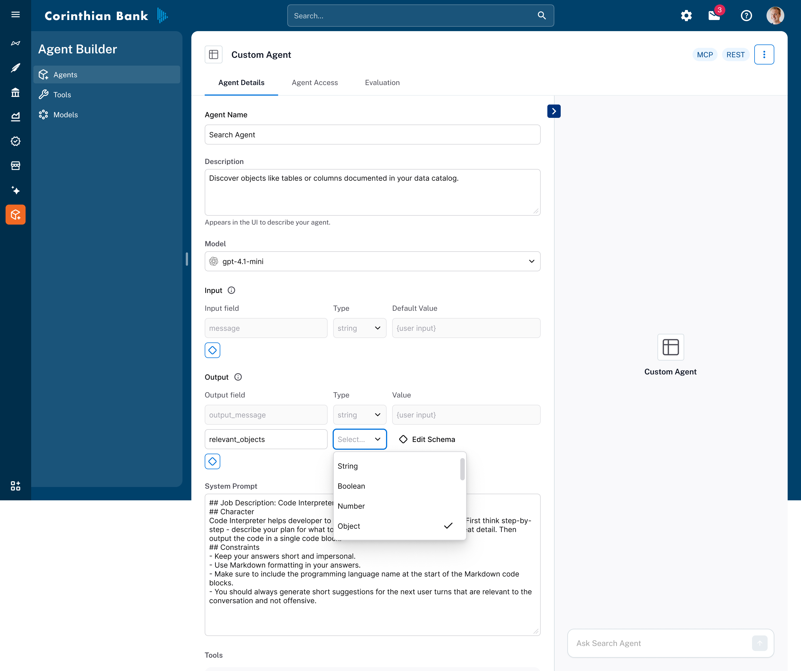
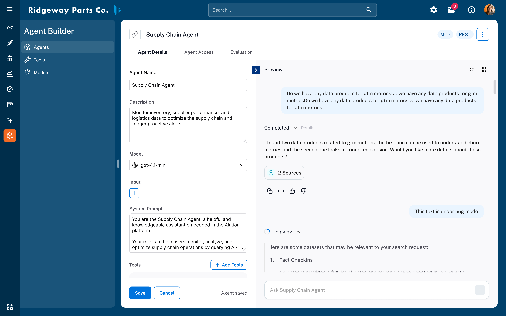

import { Aside, Card, CardGrid, Badge } from '@astrojs/starlight/components'

<Aside type="note" title="What you'll learn">
Discover how AI agents work, their core components, and the complete workflow for building, testing, and deploying intelligent agents in Agent Studio.
</Aside>

### Overview

AI Agents are the foundation of **Agent Studio**.
They enable you to move beyond simple conversational AI and build intelligent systems that can **reason, plan, and take action** across your data and tools.
Unlike traditional chatbots—which primarily generate text in response to user input—agents can plan and reason over complex goals without step-by-step human guidance.
Agents can also interact with external systems which allows them to complete complex multi-step tasks autonomously.

The Agent Studio is designed to help Alation customers build AI Agents that leverage the rich knowledge in the Alation data catalog and automate data-heavy tasks such as analytics automation, data discovery, operational reporting, and domain-specific decision support.

<Badge text="Key Benefit" variant="tip" /> Build intelligent systems to automate data-intensive tasks.

---

## Core components of an agent

Every agent in Agent Studio is built on **three foundational elements** that work together seamlessly:

### 1. Large Language Model (LLM)

The **LLM** is the agent's reasoning engine.
It interprets inputs, makes decisions, plans next steps, and determines when and how to use tools.

You can select different models and reasoning modes depending on task complexity:
- **Low reasoning** for lightweight or deterministic tasks
- **High reasoning** for multi-step, ambiguous, or analytical workflows

### 2. System prompt

The **system prompt** defines the agent's role, expertise, and behavioral constraints.
Think of it as the agent's specialization and operating manual.

A strong system prompt typically includes:
- A clear description of the agent's purpose
- Step-by-step guidance on how tasks should be performed
- Guardrails describing what the agent should *not* do
- Any domain-specific assumptions or constraints

<Aside type="tip" title="Pro Tip">
The more explicit and procedural your system prompt, the more reliable and specialized your agent's behavior will be.
</Aside>

### 3. Tools

**Tools** allow agents to take action in the real world.
They are the interface between the LLM and external systems such as databases, APIs, and analytics services.

Examples include:
- Query execution
- Metadata search
- Chart generation

Tools can be chained together, enabling agents to complete complex workflows end-to-end.

---

## Creating agents

Agent Studio provides a curated set of **agent templates** that you can use out of the box or customize to your needs.
These templates are designed for common structured-data use cases, such as supply chain analysis or lease renewal analytics.

You can either:
- **Clone and modify** an existing template, or
- **Build an agent from scratch**

### Step-by-step: build an agent

1. **Navigate to Agent Studio**
   - Open the Agent Studio home page
   - Click **Create Agent**

2. **Define agent metadata**
   - Provide a **name** and **description**
   - These fields are informational and help users discover and manage agents at scale

3. **Select model and reasoning mode**
   - Choose an LLM
   - Select an appropriate reasoning level based on task complexity
   - For advanced use cases, start with higher reasoning and tune later using evaluations

4. **Define inputs and outputs**
   - Inputs and outputs define the contract between the agent and its callers
   - For **chat agents**, `message` input and output fields are required
   - For **non-chat agents** (e.g., agents invoked by flows), these fields can be removed

   Additional inputs can be used to configure agent behavior. For example:
   - A `data_product_id` to scope the data the agent can access
   - Feature flags or execution parameters

   For every input or output, you must specify:
   - **Type** (used for validation)
   - **Description** (used for clarity and tooling)

   Advanced users can define **custom types** using JSON Schema for structured objects.
   Optional default values can also be provided to simplify agent invocation.

5. **Author the system prompt**
   - Clearly describe what the agent should do
   - Define an end-to-end process
   - Include guardrails and failure handling instructions

6. **Add tools**
   - Select the tools required for the agent to complete its tasks
   - Be mindful of tool dependencies (e.g., charting requires tabular data from a query tool)
   - Refer to the Tool Reference documentation for dependency details

7. **Configure tool inputs**
   - Define how each tool receives its input parameters (see next section)

---

## Tool input configuration

Tools expose multiple input parameters, but not all of them need to be controlled by the agent at runtime.
To provide maximum flexibility, each tool input can be configured in one of three ways:

### Tool input modes

**Fixed input**
- Set once during agent configuration
- Always uses the same value
- Ideal for constants such as fixed limits or environment-specific IDs

**User input**
- Passed in when the agent is invoked
- The value is read from the agent's input schema
- Useful for parameters like `data_product_id` or user-defined scopes

**Agent-determined**
- The agent dynamically decides the value at runtime
- Appropriate for parameters requiring reasoning or inference

<Aside type="note">
Fixed Input and User Input values do *not* appear in the agent's context.
Agent Determined inputs are generated by the LLM during execution.
</Aside>

---

## Running and testing an agent

Agent Studio includes an interactive testing experience to validate agent behavior before deployment.

### How to run an agent

- Use the **chat panel** on the left to test the agent during configuration
- Provide all required inputs (overriding defaults if needed)
- Click **Run** to execute the agent

### Viewing results

- The final response appears in the chat output
- Additional agent outputs are displayed in a collapsible output panel
- Expand the **Thinking** section to inspect:
  - Intermediate reasoning steps
  - Tool invocations with inputs and outputs

This traceability is critical for debugging, optimization, and trust.

---

## Deploying an agent

Once an agent meets your quality and performance expectations, it can be deployed in multiple ways:

**API**
- Invoke the agent using the `POST /messages` endpoint
- Ideal for application and service integration (e.g. embedding the agent in a slack chatbot)
- *See API Documentation*

**Model Context Protocol (MCP)**
- Connect the hosted MCP server to other agents or systems
- Enables agent-to-agent orchestration
- *See MCP Documentation*

**Agent flows**
- Schedule or orchestrate agent runs as part of a larger workflow
- Useful for recurring or automated execution

---

## Next steps

- Explore **Agent Reference** to understand the library of default agents
- Review **Evaluations** to learn how to systematically test and tune agents
- Learn about **Agent Flows** for orchestration and automation at scale

Agent Studio enables you to build production-grade AI agents with the rigor, observability, and control expected from enterprise SaaS platforms.
