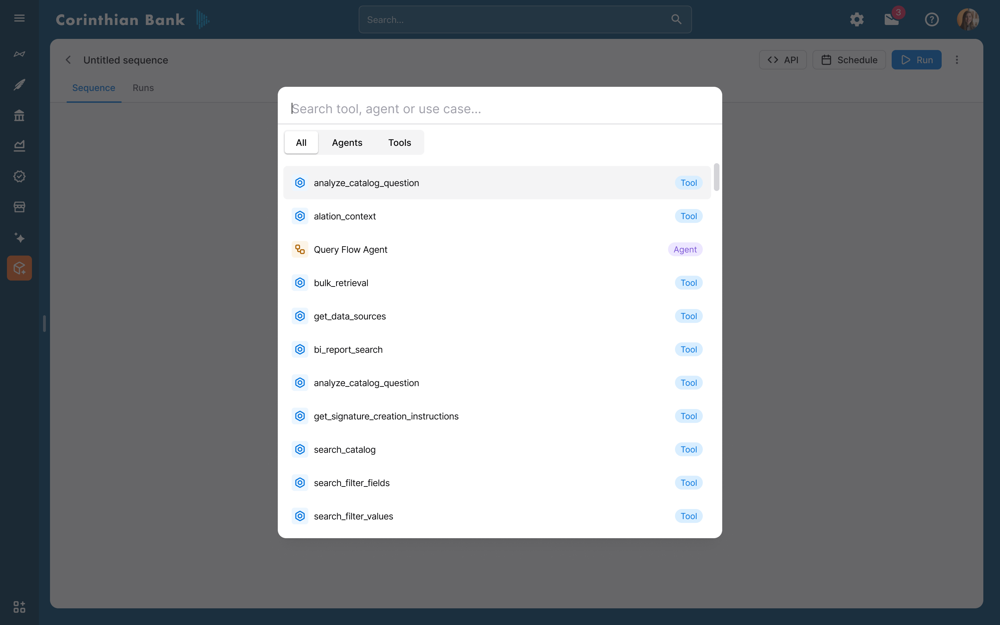
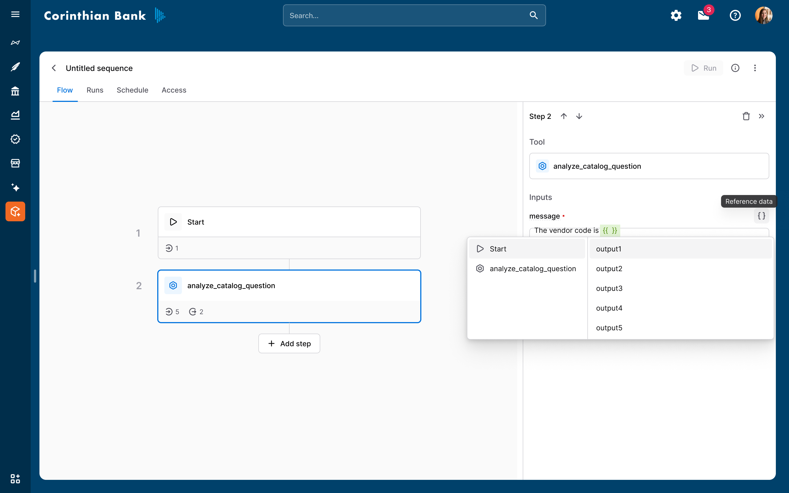
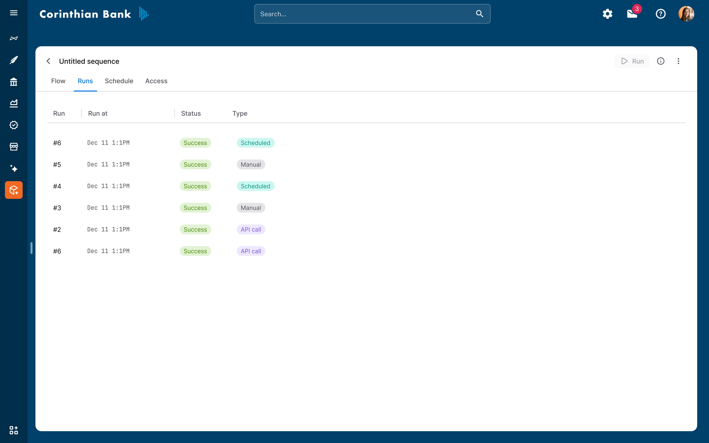

import { Aside, Card, CardGrid, Badge } from '@astrojs/starlight/components'

<Aside type="caution" title="Preview Feature">
Agent Flows represent the next evolution of Agent Studio, enabling enterprise-scale automation and orchestration.
This feature is currently in development.
</Aside>

### Overview

**Agent Flows** are the foundation for operationalizing AI agents at scale.
While individual agents excel at interactive and exploratory tasks, they typically require manual invocation and human guidance.
Agent Flows extend this capability by enabling agents and tools to run autonomously, in structured sequences, and on schedules.

<Badge text="Key Benefit" variant="success" /> Transform repeatable questions and workflows into automated processes that deliver insights, summaries, or actions exactly when needed.

---

## What are agent flows?

Agent Flows allow you to orchestrate a **sequence of agent and tool steps** into a single, reusable workflow.
Each flow can be:

- **Executed manually** for testing or ad hoc analysis
- **Scheduled to run automatically** (daily, weekly, monthly, etc.)
- **Parameterized** to support multiple scenarios with the same logic

This makes Agent Flows ideal for tasks that are repetitive or time-based, predictable in structure, and valuable when summarized or acted on automatically.

### Example use case

A sales representative reviews pipeline health and conversion metrics every Monday.
Instead of logging into a chatbot and asking the same questions each week, they can:

1. **Build an Agent Flow** that runs the same sales analytics agent
2. **Chain it with a notification tool** for automated delivery
3. **Schedule the flow** to run every Monday morning
4. **Receive a concise summary** directly in Slack or email

**Result:** Less manual work, faster insights, and consistent reporting.

---

## Key capabilities

**Visual flow builder**
- Drag-and-drop interface for chaining agents and tools
- Intuitive workflow design and modification

**Typed input parameters**
- Reusable, scenario-based execution patterns
- Input validation and type safety

**Agent steps**
- AI-driven reasoning and analysis within workflows
- Complex decision-making capabilities

**Tool steps**
- Deterministic actions such as notifications, tickets, and API calls
- Integration with external systems

**Output referencing**
- Pass data seamlessly between workflow steps
- Build complex data processing pipelines

**Manual runs and scheduling**
- Test flows manually during development
- Deploy with automated scheduling for production use

**Run history and status tracking**
- Complete observability and audit trails
- Performance monitoring and debugging capabilities

---

## Creating an agent flow

To create an Agent Flow, navigate to the **Flow** tab in Agent Studio and follow the steps below.

---

### Step 1: create a new flow

Click **Create New Flow** to open the flow builder.
Each flow starts with a **Start** node, which defines how the flow is invoked.

---

### Step 2: define input parameters (optional)

Input parameters allow the same flow to be reused across different contexts (for example, different sales reps, regions, or time windows).

For each input parameter, you can:
- Specify a data type (e.g., string, number)
- Define validation rules
- Provide optional default values

Inputs are available throughout the flow and can be referenced by downstream steps.

:::note
Input parameters are optional.
If your flow always runs with the same values, you can omit this step.
:::

---

### Step 3: build the flow sequence

Next, define the sequence of steps that make up your flow.
Each step can be one of two types:

#### Agent steps
Agent steps invoke an AI agent and return:
- The agent's primary message output
- Any additional structured outputs defined by the agent

These steps are ideal for reasoning, summarization, classification, or analysis.

#### Tool steps
Tool steps execute deterministic actions and are best suited for:
- Sending emails or Slack messages
- Creating tickets or records
- Triggering downstream systems via APIs

You can mix agent and tool steps freely to create end-to-end workflows.

---

### Step 4: reference outputs between steps

Flows become powerful when steps build on one another.
Any step can reference outputs from **previous steps** using the `{{ }}` syntax.

For example:
- Use an agent's summary as input to a notification tool
- Pass a classification result into a conditional action

**Important rules:**
- Only outputs from earlier steps can be referenced
- All required inputs must be resolved for the flow to be valid

The flow builder automatically validates these references before execution.

---

### Step 5: validate the flow

A flow can only be executed when:
- All steps have valid inputs
- All required references resolve correctly
- Input types match the expected schema

Validation errors are surfaced directly in the builder to help you resolve issues quickly.

---

## Running an agent flow

Agent Flows support both **manual execution** and **scheduled runs**.

---

### Manual (dry) runs

For testing or one-off execution:
1. Click **Run**
2. Provide values for any input parameters
3. Execute the flow and review results step by step

This is the recommended approach while developing and refining a flow.

---

### Scheduled runs

Once you are satisfied with the flow:
- Attach one or more schedules (e.g., daily, weekly, monthly)
- Define the input values for each schedule
- Deploy the flow to run automatically

Each schedule acts as an independent trigger, enabling the same flow to serve multiple use cases.

---

### API runs

Just like agents, agent flows can also be invoked programmatically via API.
For advanced users that want to build custom schedules or trigger, the API route provide more flexibility for automation.

Each schedule acts as an independent trigger, enabling the same flow to serve multiple use cases.

---

## Monitoring and run history

The **Run History** tab provides visibility into all executions of a flow, including:
- Run time
- Trigger type (manual, scheduled, API)
- Execution status (success or failure)

This makes it easy to audit past runs, troubleshoot failures, and confirm successful execution over time.

---

## Summary

Agent Flows bridge the gap between interactive AI and automated operations.
By chaining agents and tools into structured, repeatable workflows, you can:
- Eliminate repetitive manual tasks
- Ensure consistent execution
- Deliver insights and actions proactively

As Agent Flows evolve, they will become the backbone for scalable, autonomous AI-driven operations across your organization.
