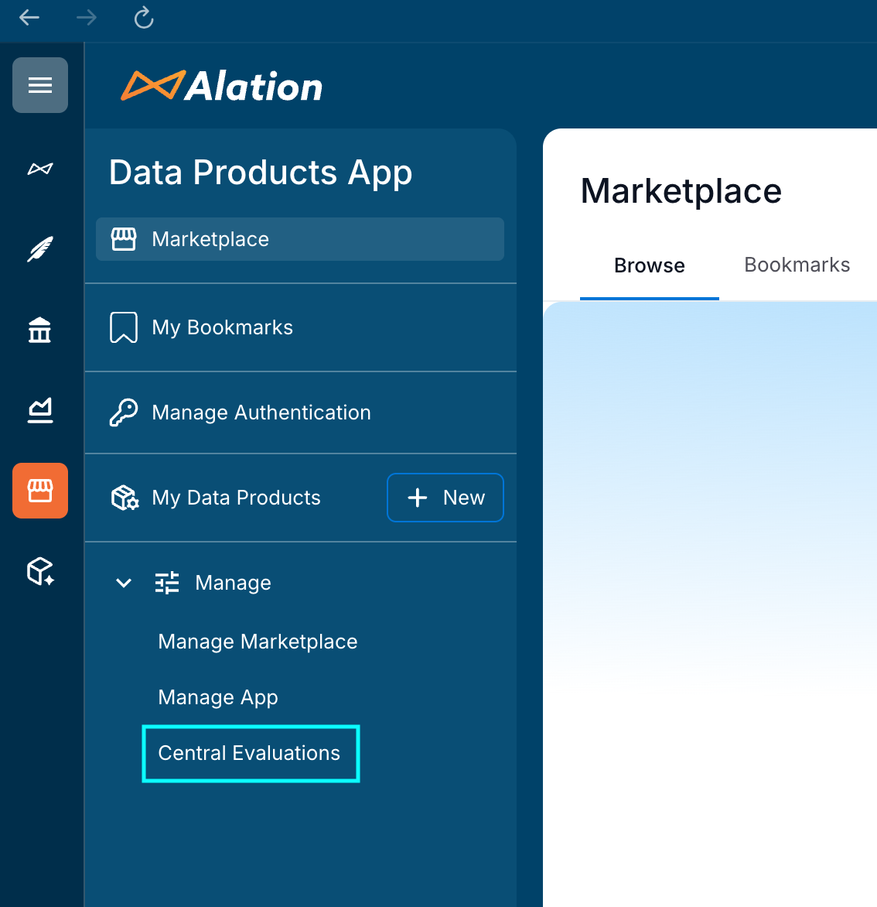
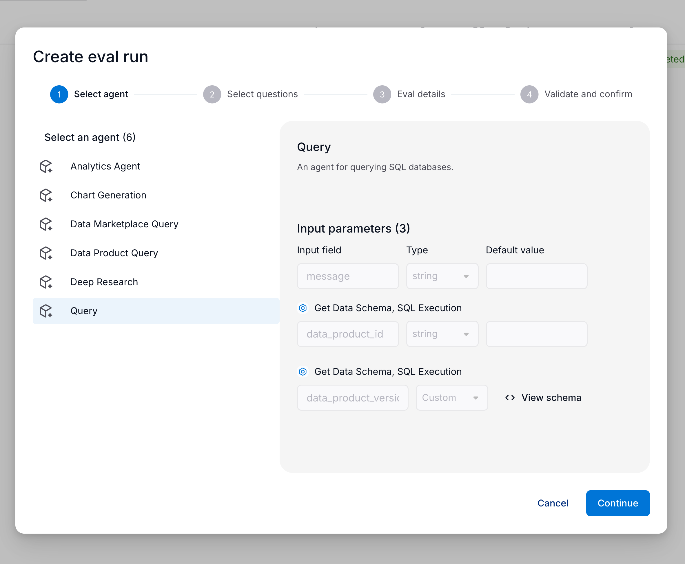
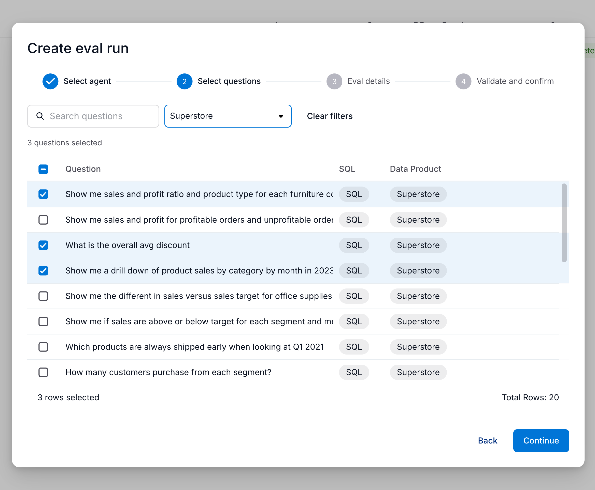
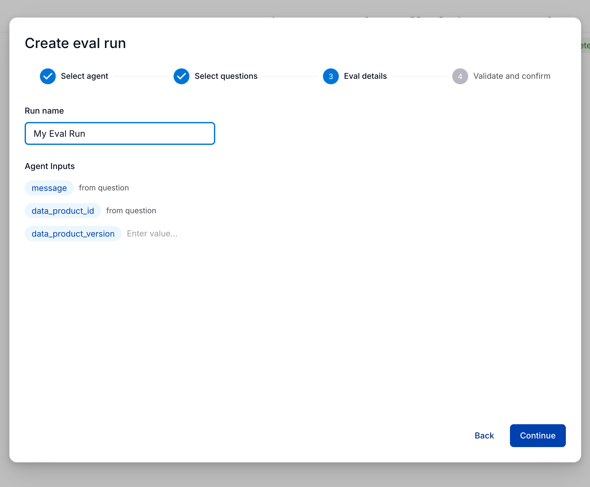
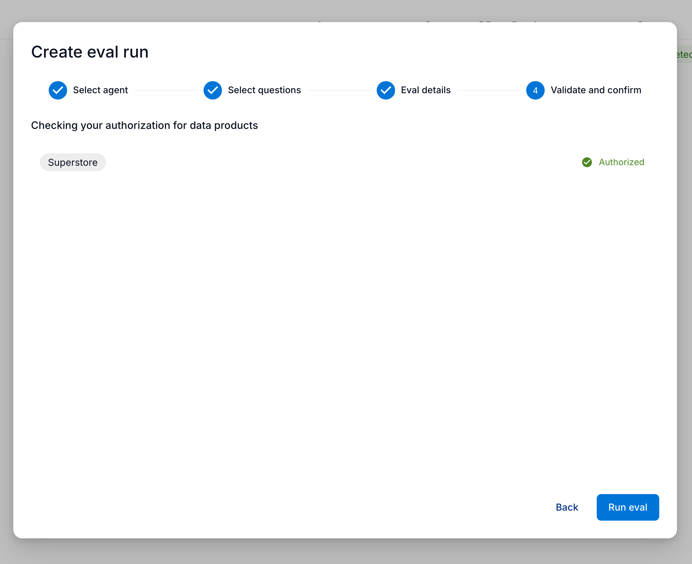
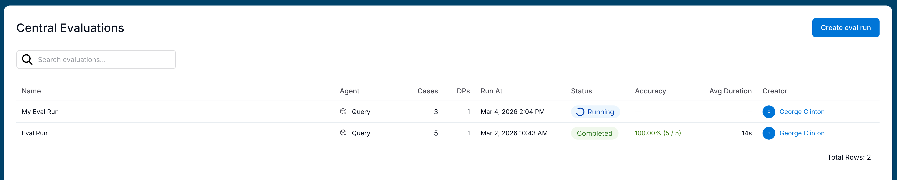
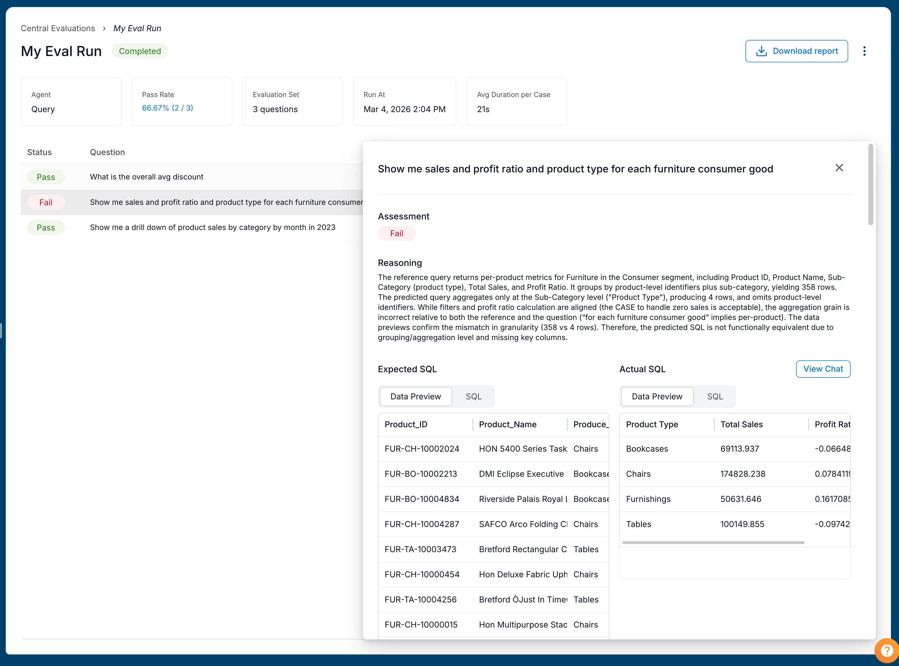

import { Aside, Card, CardGrid, Badge } from '@astrojs/starlight/components'

<Aside type="note" title="What you'll learn">
In this guide, you’ll learn how evaluations work in Agent Studio, and how you can use them to monitor performance and accuracy of your agents over time.
</Aside>

### What are evaluations?

Evaluations allow you to systematically and repeatedly test your agents' accuracy and latency on a set of predefined test cases.
This is particularly important when developing agents which can query data, since it ensures the agent is accessing and interpreting data correctly.

The [SQL Evaluations for Data Products](/agent-studio-docs/reference/evaluation/data-product-evaluations) article includes details on how to create high-quality evaluation cases related to a specific Data Product.
Those cases can be used to evaluate any agent with the [SQL execution](/agent-studio-docs/reference/tools/sql-execution-tool) tool.

## Central Evaluations

To easily create and manage evaluation runs across all your agents and Data Products, navigate to the "Central Evaluations" section of the Data Products tab in your Alation instance.

*Accessing the Central Evaluations Page from the Data Product details page.*

### Creating an evaluation run

To run evaluation, first select an agent which has the SQL execution tool attached.

*Selecting a SQL-compatible agent to run the evaluation on.*

Next, select the test cases you want to run the evaluation on.
These cases are obtained from Data Products for which the user is an admin.
These can be filtered by Data Product, searched by the case input, and selected individually to customize the evaluation run.

*Selecting test cases to include in the evaluation run.*

Then, configure any input parameters required by the agent.
The `message` and `data_product_id` parameters will be populated by each case.

*Configuring input parameters for the evaluation run.*

Finally, a pre-flight authorization check will verify that the user has data access configured.
If the check fails, you can click on the data product name to navigate to the data product details page and configure access.

*Pre-flight authorization check before running the evaluation.*

Multiple evaluations can be created and run at the same time, regardless of the agent or cases selected.

### Evaluation results

A user can see all evaluation runs on data products for which they are an admin.
If an evaluation run covers multiple data products, the user must be an admin on all of them to see the run.
This allows multiple admins to review run history and collaboratively iterate on improving agent accuracy and performance.

*History of evaluation runs for a specific data product.*

Detailed results for each run are accessible by clicking into the run from the history page.
The results page includes the number of cases, the pass rate, and the average time to complete the chat for all cases.

*Detailed results for an evaluation run, including pass/fail status for each case and execution time.*

Each case includes a reason for why it passed or failed, which can be used to identify areas for improvement.
The flowchart for how cases are scored is included in the [SQL Evaluations for Data Products](/agent-studio-docs/reference/evaluation/data-product-evaluations#understanding-evaluation-results) article.
