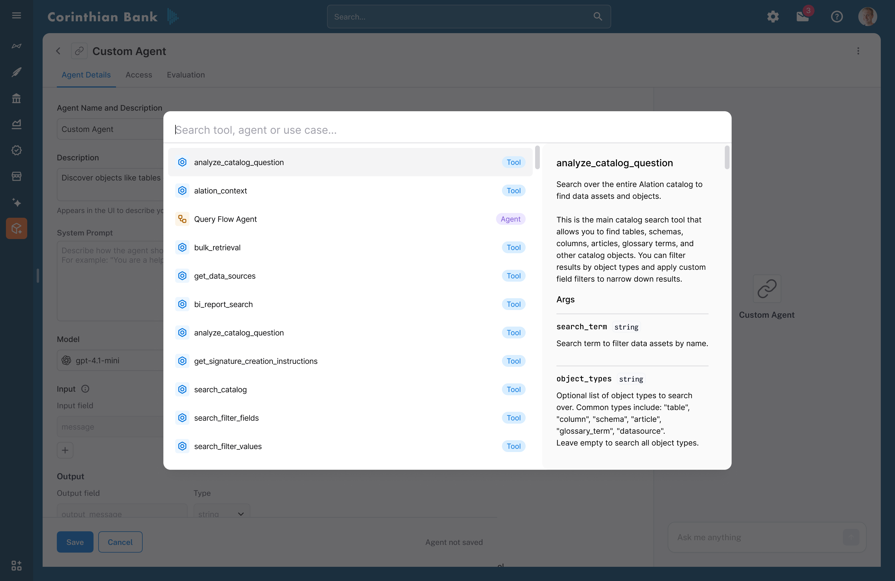
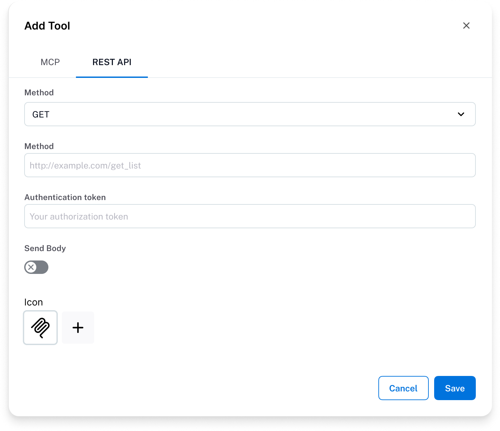
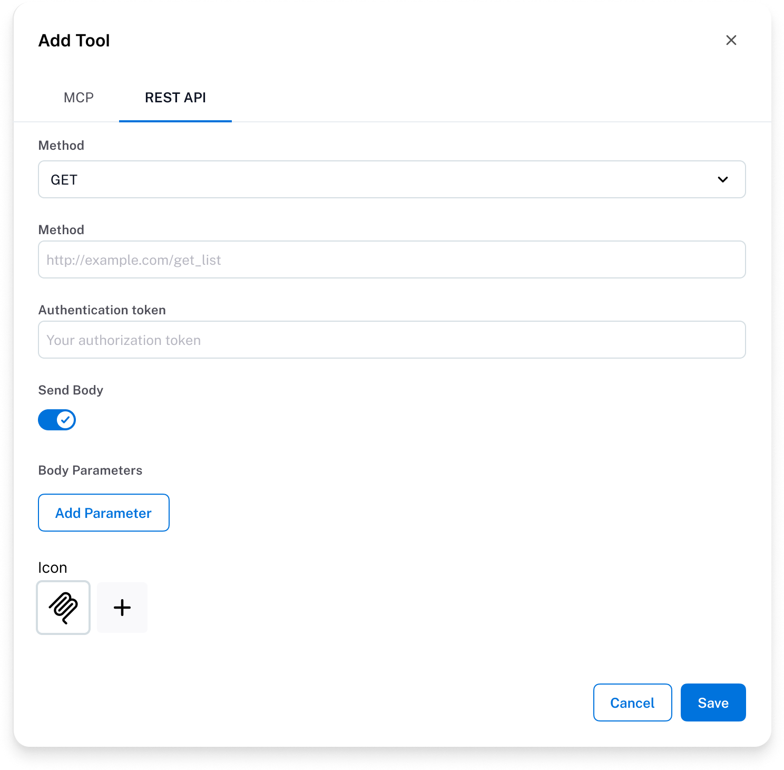
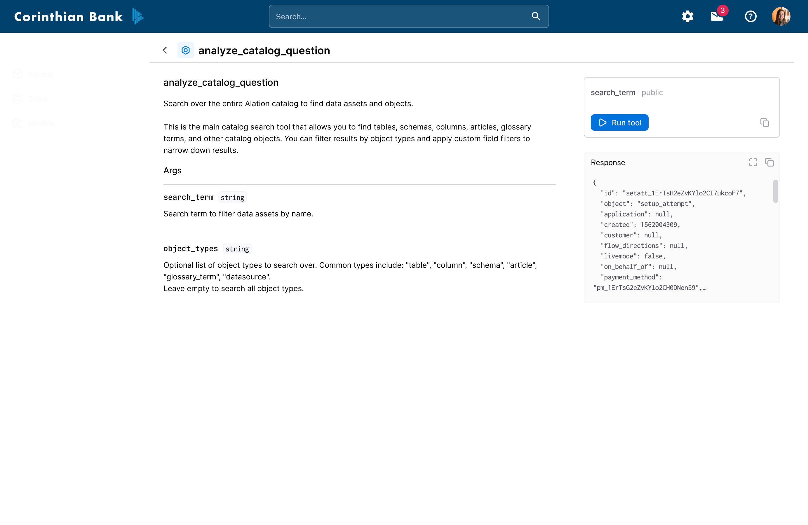

import { Aside, Card, CardGrid, Badge } from '@astrojs/starlight/components'

<Aside type="note" title="What you'll learn">
In this guide, you’ll learn how tools work in Agent Studio, understand the difference between custom and default tools, and discover how to create and test custom tools for your agents.
</Aside>

### Overview

Tools are a one of the core building blocks of **Agent Studio**.
They define how agents interact with software systems, enabling agents to take concrete, observable actions in the real-world such as querying the Alation Data Catalog, retrieving metadata, or calling external services.

In practice, tools act as the **execution layer** for agents.
While the model is responsible for reasoning and decision-making, tools are responsible for performing the actual work.

<Badge text="Key Benefit" variant="tip" /> Connect data agents to internal and external software systems.

---

### What is a tool?

A tool is a structured, callable interface that an agent can invoke to perform a specific operation.
Each tool exposes a clear contract that the agent can reason over to determine:
- *When* the tool should be used
- *How* to call the tool correctly
- *How* to interpret the results

#### Tool components

Every tool definition includes three essential components:

**1. Tool instructions**
- Natural-language descriptions of the tool's purpose and intended usage
- Critical guidance that helps agents select the right tool at the right time

**2. Tool inputs (arguments)**
- Structured parameters with data types and descriptions
- Define what information the tool needs to execute properly
- Enable agents to generate valid tool calls with correctly formatted parameters

**3. Tool outputs**
- Clear specifications of what data the tool returns
- Allow agents to interpret results accurately and decide on follow-up actions

<Aside type="tip">
Clear and precise instructions significantly improve an agent's ability to choose and use tools reliably.
</Aside>

Together, instructions, inputs, and outputs form a **tool contract** (sometimes referred to as a "tool card") that agents use to reason about tool selection and execution.

---

*A tool definition in Agent Studio, including instructions, input parameters, and outputs.*

---

### Deterministic vs. non-deterministic tools

Most tools in Agent Studio are **deterministic**.
Given the same inputs, these tools return the same outputs every time.

Some tools can be **non-deterministic**, such as tools that invoke another agent as a sub-agent.
In these cases, outputs may vary depending on context, prior conversation state, or reasoning paths.

Understanding this distinction is important when designing agents that depend on consistent or repeatable behavior.

---

## Default tools

### Overview

Default tools are **built-in tools** provided by Agent Studio to support common operations on the Alation Data Catalog.
They are immediately available and require no additional configuration.

These tools form the core building blocks for catalog-aware agents.

### Common use cases

Default tools support a wide range of catalog operations, including:
- Searching for tables, columns, schemas, articles, and glossary terms
- Reading data product configurations
- Executing SQL queries

For a complete list of default tools and their detailed schemas, see the **Default Tools Reference** section.

---

## Creating custom tools

Custom tools allow you to extend Agent Studio beyond the built-in catalog capabilities, enabling agents to interact with external systems and perform domain-specific operations.

**Common use cases include:**
- Searching internal unstructured document repositories
- Searching public data to enrich insights like web data
- Sending email or Slack notifications

### Implementation options

Agent Studio supports two primary approaches for creating custom tools:

**Option 1: MCP tools**

Import tools from existing **Model Context Protocol (MCP) servers**.
This is the recommended approach when an MCP server is already available, as MCP tools expose structured metadata for instructions, inputs, and outputs, allowing Agent Studio to automatically understand how to call them.

**Option 2: API-based tools (REST)**

Create custom tools by defining HTTP API endpoints directly in Agent Studio.
When creating API-based tools, you must explicitly define:
- The HTTP method and endpoint
- Authentication details (headers, tokens, etc.)
- Input parameters (query parameters, headers, request body)
- Clear descriptions for each input parameter

<Aside type="note">
API-based tools require explicit definition of HTTP methods, authentication, and parameters since metadata cannot be inferred automatically.
Careful and precise definitions are essential for reliable tool usage by agents.
</Aside>

---

## Tool testing and validation

<Aside type="tip" title="Best Practice">
Always validate tools independently before attaching them to an agent to reduce debugging effort later in development.
</Aside>

Testing tools before incorporating them into an agent is a critical step in the development workflow.
It helps ensure that:
- Authentication and permissions are configured correctly
- Inputs are defined and validated properly
- The tool returns the expected response structure

### How to test a tool

To test a tool in isolation:

1. **Navigate** to the **Tools** section in Agent Studio
2. **Select** the tool you want to test
3. **Configure** by providing values for all required input fields
4. **Execute** by clicking **Run tool**
5. **Review** the response structure and data returned by the tool

Early validation reduces debugging effort later in agent development.
Once validated, the tool is ready to be integrated into your agents' reasoning and execution workflows.
