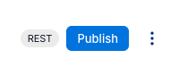
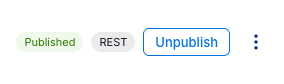
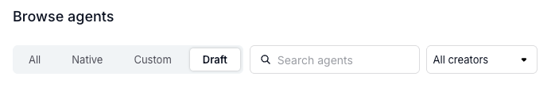

import {Aside, Badge, Code, TabItem, Tabs, Steps} from '@astrojs/starlight/components'

Agent Studio uses your existing Alation roles to enforce access controls across agents, custom tools, and flows.
The core philosophy is simple: **you always have full control over resources you create**, while restrictions only apply to actions on other people's resources.

<Aside type="tip">
Access controls apply to both the Agent Studio UI and API calls (including MCP). The same role-based rules are enforced regardless of how you interact with Agent Studio.
</Aside>

## Role tiers

Alation roles are grouped into four tiers for Agent Studio permissions:

| Tier | Roles | Summary |
|------|-------|---------|
| **Global** | Server Admin | Full control over all resources, including other users' |
| **Admin** | Catalog Admin | Can see all resources, edit others' flows |
| **Standard** | Composer, Steward, Source Admin | Full control over own resources, can publish agents as tools |
| **Restricted** | Viewer, Explorer | Read-only for agents (can view and use published agents, cannot create/edit/delete/clone) |

## Agents

### Published vs draft

Every agent has a **published status** that controls who can see it:

- **Published** agents are visible to all roles.
- **Draft** agents are only visible to the **owner** and **admin-tier roles** (Server Admin, Catalog Admin).

When you create a new agent, it starts in **draft** status. This means other non-admin users cannot see or interact with it until you publish it.

<Aside type="caution" title="Existing custom agents">
Custom agents created before the publish/draft feature was introduced are now in **draft** status. To make them visible to other users again, the agent owner must publish them. Look for these agents in the **Draft** tab.
</Aside>

### Publishing and unpublishing agents in the UI

You can publish or unpublish agents directly from the Agent Studio UI.

<Steps>
1. **Open your agent** in Agent Studio.

2. **Locate the publish controls** in the top-right corner of the agent page.
   - Draft agents show a **Publish** button.
   - Published agents show a **Published** badge and an **Unpublish** button.

   

   

3. **Click the button** to toggle the published status.
   - Clicking **Publish** makes the agent visible to all users.
   - Clicking **Unpublish** returns the agent to draft status, hiding it from non-admin users.
</Steps>

### Finding draft agents

Your draft agents appear in the **Draft** tab when browsing agents. Other users' draft agents are not visible to you unless you are a Server Admin or Catalog Admin.



<Aside type="tip" title="Can't find your custom agents?">
If your custom agents are missing from the **All** or **Custom** tabs, check the **Draft** tab. Existing custom agents created before the publish/draft feature are now in draft status and must be published to be visible to other users.
</Aside>

<Aside type="caution">
If you unpublish an agent that others are using, they will no longer be able to see or interact with it. The agent will only be visible in your Draft tab and to admin-tier roles.
</Aside>

### Permission matrix

| Action | Server Admin | Catalog Admin | Standard roles | Viewer / Explorer |
|--------|:---:|:---:|:---:|:---:|
| Create agent | Yes | Yes | Yes | No |
| Edit own agent | Yes | Yes | Yes | No |
| Edit others' agent | Yes | No | No | No |
| Delete own agent | Yes | Yes | Yes | No |
| Delete others' agent | Yes | No | No | No |
| Set own agent published / draft | Yes | Yes | Yes | No |
| Set others' agent published / draft | Yes | No | No | No |
| Publish / unpublish own agent as tool | Yes | Yes | Yes | No |
| Publish / unpublish others' agent as tool | Yes | No | No | No |
| Clone others' agent | Yes | Yes | Yes | No |
| See others' draft agents | Yes | Yes | No | No |
| See published agents | Yes | Yes | Yes | Yes |
| Use published agents | Yes | Yes | Yes | Yes |

### Visibility

When a non-admin user lists agents, they see only **published agents** plus **their own drafts**.

### Agent-as-tool visibility

When an agent is published as a tool (for use in MCP or as a sub-agent), the tool inherits the parent agent's visibility:

- If the parent agent is **published**, the tool appears for all users.
- If the parent agent is **draft**, the tool only appears for the owner and admin-tier roles.

<Aside type="note">
**Published status** and **publish as tool** are independent concepts. Published status controls who can *see* the agent. Publishing as a tool creates an MCP tool entry so other agents or MCP clients can *invoke* it.
</Aside>

### Publishing an agent via API (alternative)

You can also change an agent's published status programmatically. Send a `PATCH` request:

<Tabs>
<TabItem label="curl">
```bash
curl -X PATCH 'https://<your-tenant>.alationcloud.com/ai/api/v1/config/agent/<agent-id>' \
  -H 'Content-Type: application/json' \
  -H 'x-csrftoken: <your-csrf-token>' \
  -H 'Cookie: sessionid=<your-session-id>; csrftoken=<your-csrf-token>' \
  -d '{"published_status": "published"}'
```
</TabItem>
<TabItem label="Bearer token">
```bash
curl -X PATCH 'https://<your-tenant>.alationcloud.com/ai/api/v1/config/agent/<agent-id>' \
  -H 'Content-Type: application/json' \
  -H 'Authorization: Bearer <your-oauth-token>' \
  -d '{"published_status": "published"}'
```
</TabItem>
</Tabs>

To unpublish (set back to draft), use `{"published_status": "draft"}`.

**Who can change published status:**
- Standard roles and above can set their **own** agent to published or draft.
- Viewer and Explorer roles **cannot** change published status (they cannot edit agents at all).
- Only Server Admin can change **other users'** agents' published status.

**Finding your agent ID:**

The agent ID is visible in the URL when viewing an agent in the Agent Studio UI:
```
https://<tenant>.alationcloud.com/app/studio/agents/a/<agent-id>
```

You can also list all your agents via the API:
```bash
GET /ai/api/v1/config/agent
```

## Custom tools (SMTP / HTTP)

Custom tools have simpler access controls than agents because they have no visibility filtering -- all custom tools are visible to all authenticated users.

| Action | Server Admin | Catalog Admin | Standard roles | Viewer / Explorer |
|--------|:---:|:---:|:---:|:---:|
| Create tool | Yes | Yes | Yes | Yes |
| Edit own tool | Yes | Yes | Yes | Yes |
| Edit others' tool | Yes | No | No | No |
| Delete own tool | Yes | Yes | Yes | Yes |
| Delete others' tool | Yes | No | No | No |
| See all tools | Yes | Yes | Yes | Yes |

## Flows (workflows)

Flows have two unique access control behaviors compared to agents:

1. **Catalog Admin can edit others' flows** (unlike agents, where they cannot).
2. **Viewer and Explorer cannot trigger others' flows** (but can trigger their own).

| Action | Server Admin | Catalog Admin | Standard roles | Viewer / Explorer |
|--------|:---:|:---:|:---:|:---:|
| Create flow | Yes | Yes | Yes | Yes |
| Edit own flow | Yes | Yes | Yes | Yes |
| Edit others' flow | Yes | **Yes** | No | No |
| Delete own flow | Yes | Yes | Yes | Yes |
| Delete others' flow | Yes | No | No | No |
| See all flows | Yes | Yes | Yes | Yes |
| Trigger own flow | Yes | Yes | Yes | Yes |
| Trigger others' flow | Yes | Yes | Yes | **No** |

## Ownership and role changes

Access controls are based on **ownership**, which is determined by the user that created the resource. Ownership does not change when a user's role changes.

This means:
- If a Composer creates an agent and is later downgraded to Viewer, they **lose the ability to edit or delete** that agent. Viewer and Explorer roles have read-only access to agents.
- Viewer and Explorer roles can still **see and use** published agents, including agents they previously created.

Role changes take effect **immediately** on the next request. There is no need to log out and log back in.

## MCP and OAuth

When connecting via MCP or using OAuth authentication, the same role-based access controls apply. Your role is determined by how you authenticate:

- **User sessions** -- your Alation role is used directly.
- **Machine-to-machine (M2M) OAuth apps** -- the role assigned to the OAuth application when it was created is used.

MCP tool visibility follows the same rules as the API: draft agent-as-tools are only visible to the owner and admin-tier roles.

## Error responses

Agent Studio uses standard HTTP status codes for access control errors:

| Status code | Meaning |
|-------------|---------|
| `404 Not Found` | The resource is invisible to you (e.g., another user's draft agent). The existence of the resource is not revealed. |
| `403 Forbidden` | You can see the resource but do not have permission to perform the requested action. |
