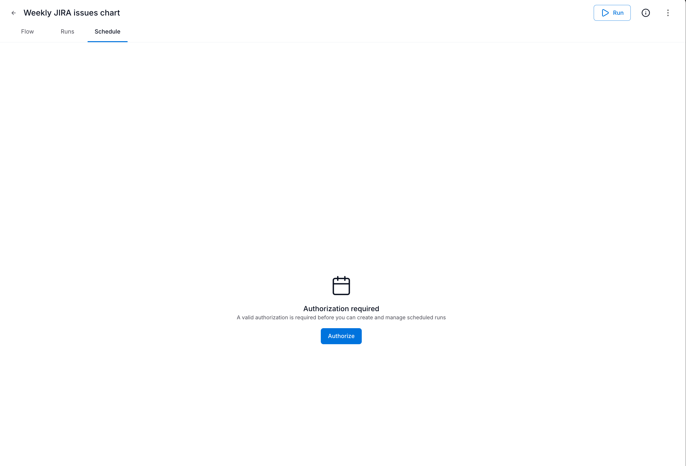
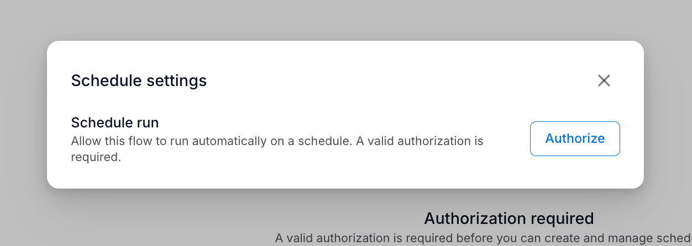
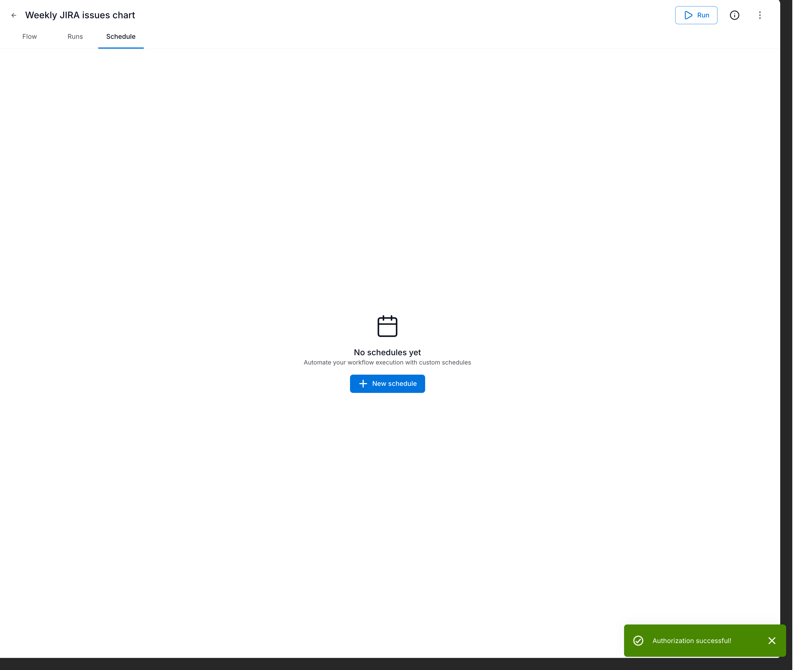
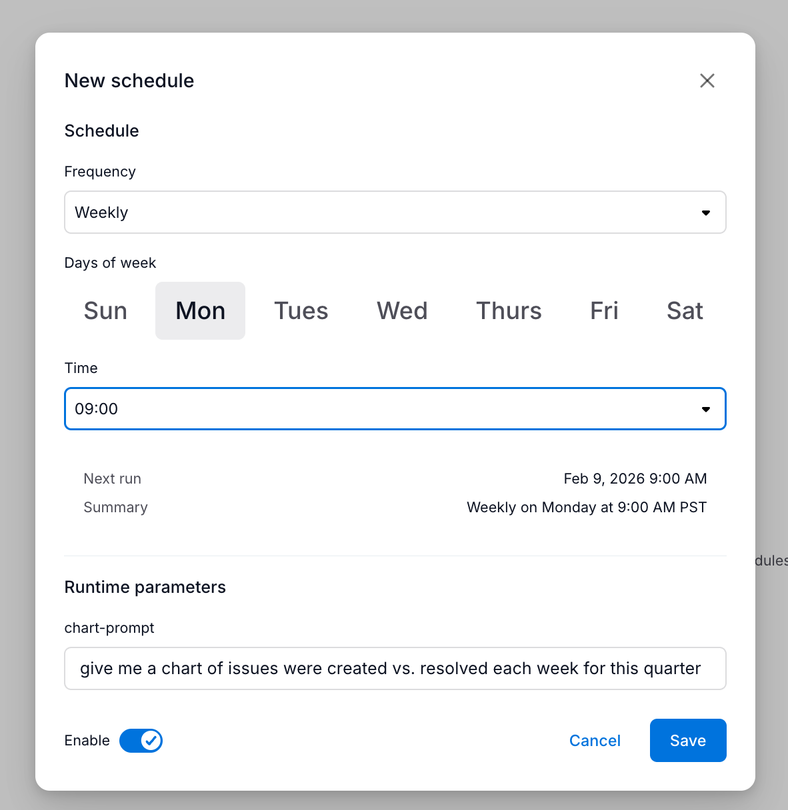

import { Aside, Steps } from '@astrojs/starlight/components'

This guide explains how to schedule flows to run automatically at defined intervals—daily, weekly, or at custom times.

## Prerequisites

Before scheduling a flow:
- You must have a saved flow ready to schedule
- An **admin** must have enabled scheduling for your tenant (one-time setup)
- You need to complete a one-time authorization (see below)

<Aside type="tip" title="Why is setup required?">
Scheduled flows run when you're not logged in—maybe at 3 AM on a Monday. To make this work, the system needs permission to act on your behalf while you're away.

This happens in two steps:
1. **Admin setup** — An admin creates a secure "handshake" between Agent Studio and Alation. This is done once for the entire organization.
2. **User authorization** — Each user grants their personal permission to use that handshake. This lets the system run flows as *you*, with *your* access rights.

Think of it like a building's key card system: the admin installs the card reader (one-time), then each employee gets their own card (individual setup).
</Aside>

## Admin setup (one-time)

<Aside type="caution" title="Admin required">
This section is for **Server Admins** only. If you're a regular user, ask your admin to complete this setup first. Once done, you can skip to [Authorization](#authorization).
</Aside>

<Steps>
1. **Generate a JWT access token**

   Follow the [Machine-to-Machine OAuth guide](/agent-studio-docs/guides/authentication/machine-to-machine/) to:
   - Create an OAuth Client Application in Alation (requires Server Admin role)
   - Generate a JWT access token using `client_id` and `client_secret`

2. **Register the OAuth app for scheduling**

   Call the registration endpoint with your admin JWT token:

   ```bash
   curl -X POST "https://your-alation-instance.alationcloud.com/ai/api/v1/oauth_app/register" \
     -H "Authorization: Bearer <admin_jwt_token>" \
     -H "Content-Type: application/json"
   ```

   A successful response confirms scheduling is enabled:

   ```json
   {
     "success": true,
     "message": "OAuth app registered successfully"
   }
   ```

3. **Verify scheduling is available**

   Users should now see the **Authorize** button in the Schedule tab instead of a disabled state.
</Steps>

<Aside type="note">
This registration only needs to be done once per Alation instance. All users on the tenant can then authorize themselves individually.
</Aside>

## Authorization

Scheduled flows run without you being logged in, so the system needs permission to act on your behalf. This is a one-time setup.

### Authorizing for the first time

<Steps>
1. Open a flow and navigate to the **Schedule** tab
2. You'll see an "Authorization required" message

   

3. Click **Authorize**

   

4. Complete the authorization in the popup window
5. You'll see a success confirmation

   
</Steps>

<Aside type="note">
Authorization is valid for 60-90 days. If it expires, scheduled flows will stop running and you'll need to re-authorize.
</Aside>

## Creating a schedule

Once authorized, you can create schedules for your flow.

<Steps>
1. Open your flow and go to the **Schedule** tab
2. Click **+ New schedule**
3. Configure the schedule settings:

   

4. Click **Save**
</Steps>

### Schedule options

| Setting | Description |
|---------|-------------|
| **Frequency** | How often to run (Daily, Weekly, Monthly) |
| **Days of week** | For weekly schedules, which days to run |
| **Time** | What time to run (in your local timezone) |
| **Runtime parameters** | Values to pass to the flow's inputs |
| **Enable** | Toggle to activate or pause the schedule |

The dialog shows a preview of when the flow will next run.

## Managing schedules

After creating a schedule, it appears in the Schedule tab:


The schedule list shows:
- **Summary** — Human-readable description (e.g., "Weekly on Monday at 9:00 AM PST")
- **Run count** — How many times the schedule has triggered
- **Last run** — When it last executed and whether it succeeded
- **Enable toggle** — Quickly enable or disable without deleting

### Editing a schedule

Click on a schedule to edit its settings. You can change the frequency, time, or runtime parameters.

### Disabling a schedule

Toggle the **Enable** switch to pause a schedule without deleting it. The schedule retains its configuration and can be re-enabled at any time.

### Deleting a schedule

Click the actions menu (three dots) and select **Delete** to remove a schedule permanently.

## Viewing scheduled runs

Scheduled runs appear in the flow's **Runs** tab alongside manual runs. Each run shows:
- When it executed
- Whether it was triggered by a schedule or manually
- Status (Completed, Failed, Running)

Click any run to see detailed step-by-step execution logs.

## Troubleshooting

### Schedule not running

| Issue | Solution |
|-------|----------|
| Authorization expired | Re-authorize in the Schedule tab |
| Schedule disabled | Check the Enable toggle |
| Flow has validation errors | Fix errors and save the flow |
| Scheduling not available | Ask your admin to complete the [admin setup](#admin-setup-one-time) |

### Authorization errors

If you see "Authorization failed" in run history:
1. Go to the **Schedule** tab
2. Click **Authorize** to refresh your credentials
3. Complete the authorization flow

### Schema drift errors

If a scheduled run fails with a "schema mismatch" or similar error, it means an [agent](/agent-studio-docs/getting-started/agents/) or [tool](/agent-studio-docs/getting-started/tools/) used in your flow was modified after the flow was created.

**What causes this:**
- An agent's output fields were renamed or removed
- A tool's required inputs changed
- The agent or tool was deleted entirely

**How to fix it:**
1. Open the flow in the editor
2. Check each step for validation errors (usually highlighted)
3. Update the variable mappings to match the new inputs/outputs
4. Save the flow and re-run

<Aside type="tip">
Flows validate agent and tool schemas at runtime, not when saved. This means a flow can save successfully but fail later if a referenced agent or tool changes. Test your flow manually after making changes to upstream agents or tools.
</Aside>

## Next steps

- [Variables and Context](/agent-studio-docs/guides/flows/variables/) — Learn how data flows between steps
- [Flows overview](/agent-studio-docs/getting-started/flows/) — Return to the main flows introduction
