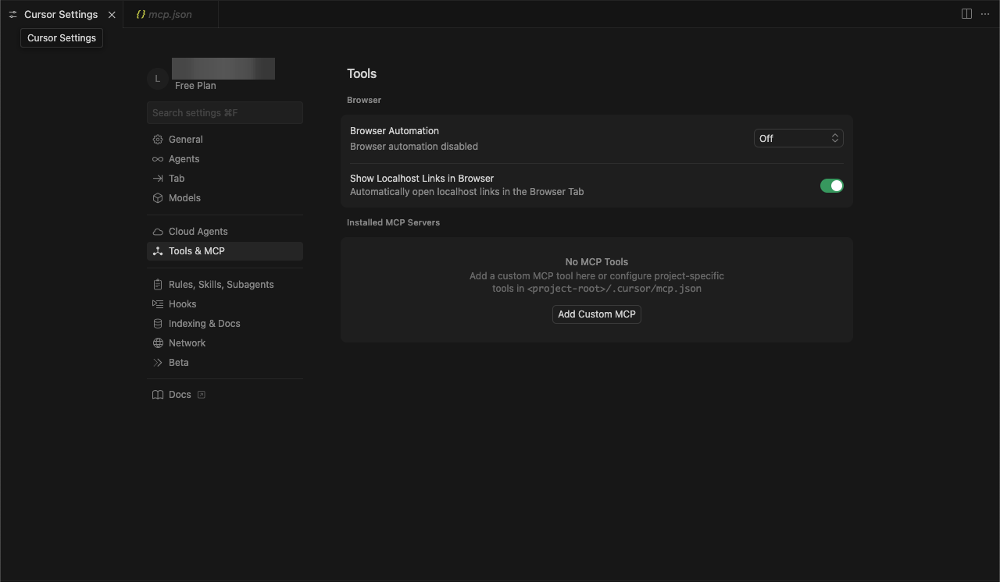
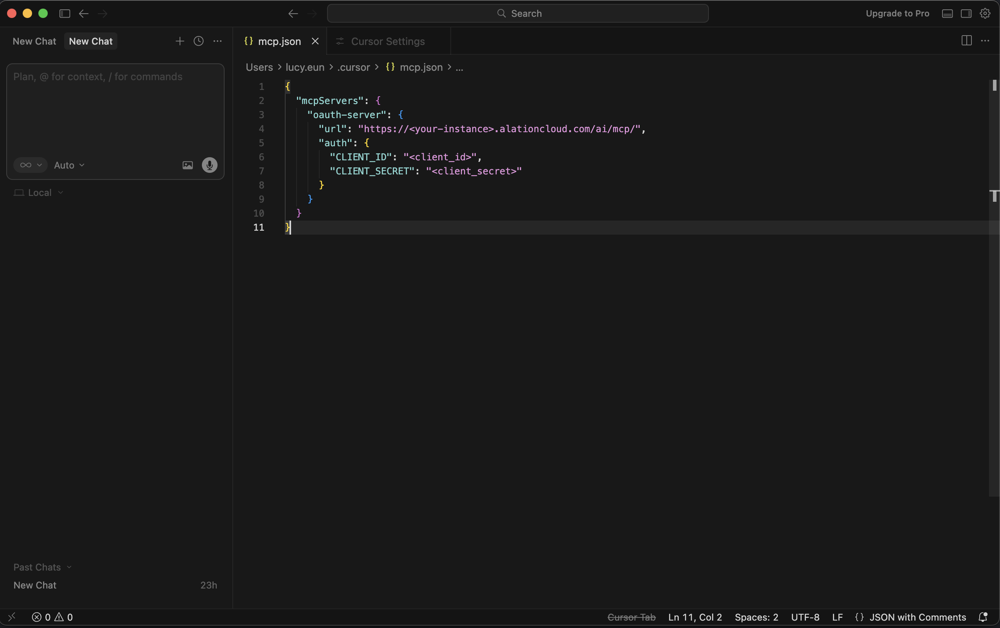
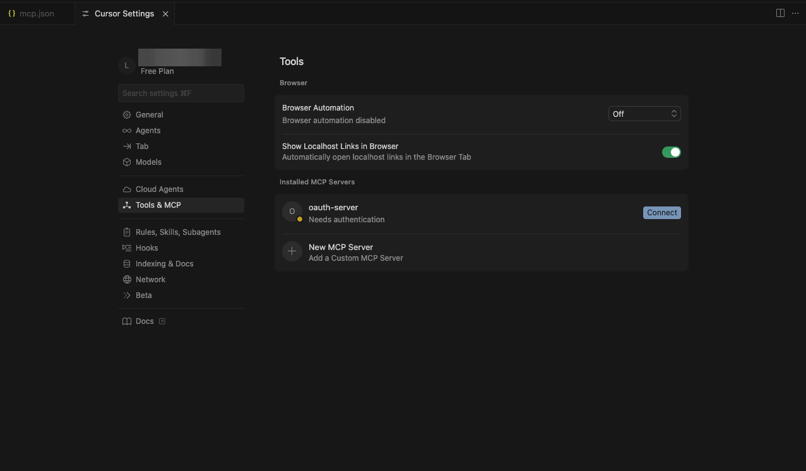
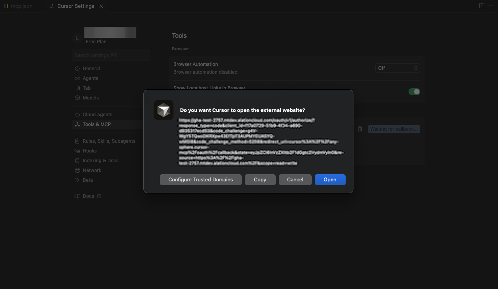
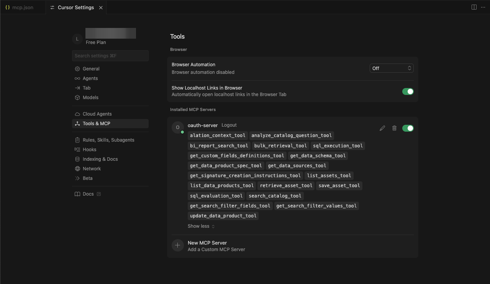

import { Steps } from '@astrojs/starlight/components';

Connect your Alation catalog to Cursor using the Remote MCP Server with OAuth authentication.

:::note
This guide covers **Remote MCP** setup with OAuth authentication in Cursor.
:::

## Prerequisites
- **OAuth Client credentials** from your Alation instance ([Create OAuth Client](/agent-studio-docs/guides/authentication/user-initiated-auth/))
- **Cursor** v0.45.6 or later

## Add Custom MCP
<Steps>

1. Open MCP Settings

    Navigate to Tools & MCP tab on the Cursor Settings page.

    

2. Add Custom MCP

    Click on the **Add Custom MCP** button to start the configuration process.
    This will open an `mcp.json` configuration file where you can specify the details for your custom MCP.

</Steps>

## Adding the MCP Server
  Copy and Paste the following json into the `mcp.json` file.
  Replace the placeholder values with your actual Alation instance details.
  ```json
  {
    "mcpServers": {
      "alation-server": {
        "url": "https://<your-instance>.alationcloud.com/ai/mcp/",
        "auth": {
          "CLIENT_ID": "<client_id>",
          "CLIENT_SECRET": "<client_secret>"
        }
      }
    }
  }
  ```
  

## Connecting (authentication)

<Steps>

1. Connect to the MCP Server

    Go back to the **MCP Settings** page.
    You should see the alation mcp server under **Installed MCP Servers** list.
    Click on the **Connect** button next to your Alation MCP Server.
    

2. Authenticate

    This will open a new window where you can authenticate with your Alation instance.
    Login with your Alation credentials.
    

</Steps>

## Verify Connection
Once authenticated, you should be able to see the list of tools available.
