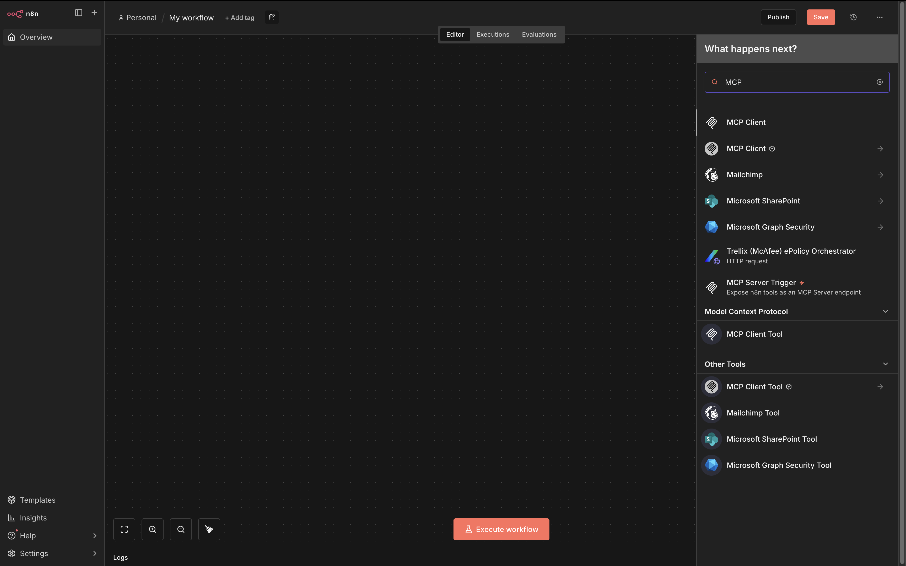
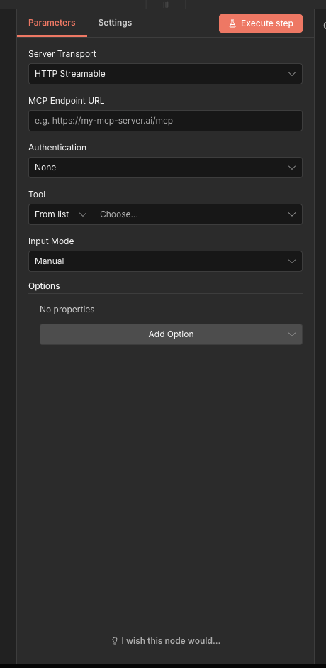
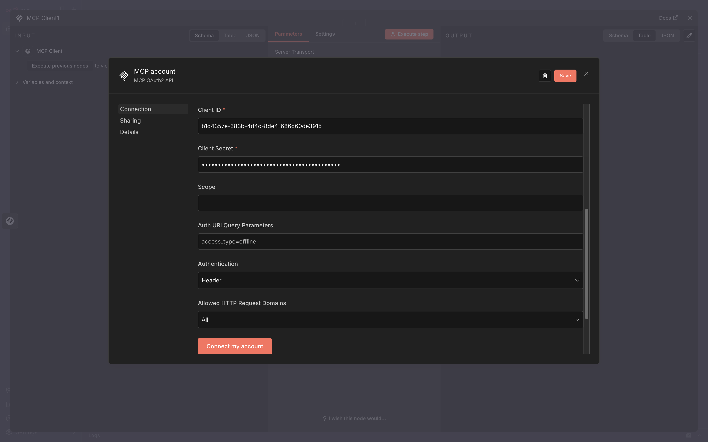
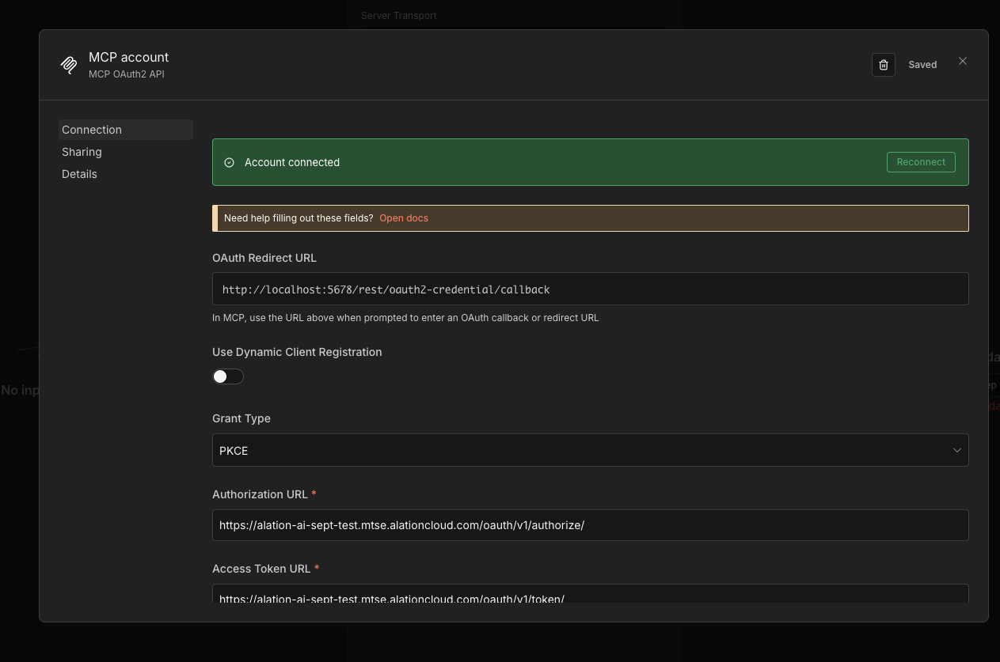

import { Steps } from "@astrojs/starlight/components";

Connect your Alation catalog to n8n using the Remote MCP server with OAuth authentication.

## Prerequisites

- **OAuth Client credentials** from your Alation instance or a Server Admin role to create one.
- **n8n instance** with built-in [MCP Client Tool node](https://docs.n8n.io/integrations/builtin/cluster-nodes/sub-nodes/n8n-nodes-langchain.toolmcp/) support

## Add an MCP Client Node in n8n

<Steps>

1. **Search for MCP Client Tool**

   In the n8n editor, search for "MCP" in the node panel. Select **MCP Client Tool** under "Model Context Protocol" (the built-in node, not the community package).

   

2. **Configure server transport**

   Set the following parameters:

   | Field | Value |
   |-------|-------|
   | Server Transport | `HTTP Streamable` |
   | MCP Endpoint URL | `https://<YOUR_INSTANCE>.alationcloud.com/ai/mcp` |

   

</Steps>

## Connecting (Authentication)

Alation supports two authentication methods:

| Method | Use Case |
|--------|----------|
| **MCP OAuth2** | Recommended for user-delegated access |
| **Bearer Auth** | Service account style access (requires manual token refresh) |

### MCP OAuth2 Setup

<Steps>

1. **Select MCP OAuth2 authentication**

   In the Authentication dropdown, select **MCP OAuth2**, then click the credential dropdown and select **Create New Credential**.

2. **Disable Dynamic Client Registration**

   Toggle **Use Dynamic Client Registration** to **Off**. This reveals the manual OAuth configuration fields.

   

3. **Note the OAuth Redirect URL**

   Copy the **OAuth Redirect URL** shown at the top of the form (e.g., `http://localhost:5678/rest/oauth2-credential/callback`). You'll need this when creating your OAuth Client in Alation.

4. **Create an OAuth Client in Alation**

   Refer to the [OAuth 2.0 User Initiated Authentication Guide](/agent-studio-docs/guides/authentication/user-initiated-auth) to create an OAuth Client. Use these settings:

   | Field | Value |
   |-------|-------|
   | name | Any name (e.g., `n8n-mcp-client`) |
   | client_type | `confidential` |
   | redirect_uris | The OAuth Redirect URL from Step 3 |
   | refresh_token_expiry | `259200` (3 days in seconds) |
   | access_token_expiry | `3600` (1 hour in seconds) |
   | pkce_required | `true` |

   Save the `client_id` and `client_secret` securely.

5. **Configure OAuth2 credentials**

   Fill in the credential form:

   | Field | Value |
   |-------|-------|
   | Grant Type | `PKCE` |
   | Authorization URL | `https://<YOUR_INSTANCE>.alationcloud.com/oauth/v1/authorize/` |
   | Access Token URL | `https://<YOUR_INSTANCE>.alationcloud.com/oauth/v1/token/` |
   | Client ID | Your client ID from Alation |
   | Client Secret | Your client secret from Alation |
   | Scope | Leave blank |
   | Auth URI Query Parameters | Leave blank |
   | Authentication | `Header` |

   

6. **Connect your account**

   Click **Connect my account**. A browser window opens for Alation login. Sign in with your credentials.

7. **Verify connection**

   After signing in, you'll see "Account connected". Click **Save** to close the credential dialog.

   

</Steps>

### Bearer Auth setup

<Steps>

1. **Obtain an access token**

   Refer to the [OAuth 2.0 M2M Authentication Guide](/agent-studio-docs/guides/authentication/machine-to-machine) to create an OAuth Client and obtain an access token.

2. **Configure Bearer Auth**

   Select **Bearer Auth** from the Authentication dropdown, then enter your access token.

   

3. **Save credentials**

   Click **Save** to close the credential dialog.

</Steps>

:::note[SQL-executing tools]
If you plan to use tools that execute SQL queries (SQL Execution, Get Data Schema), you must first [configure data warehouse credentials](/agent-studio-docs/guides/authentication/machine-to-machine/#configuring-data-warehouse-credentials).
:::

## Troubleshooting

- **n8n version compatibility?** Ensure you're running n8n version 1.93 or later, which includes built-in MCP Client Tool support with OAuth.

- **Zscaler or VPN issues with localhost?** When running n8n locally (localhost), disable Zscaler or other security proxies before attempting the OAuth flow, as they can interfere with the authentication redirect.

- **OAuth flow fails or loops?** Log out of any existing Alation sessions in your browser before attempting the OAuth login.

- **Authentication errors?** Verify the Authorization URL and Access Token URL include a trailing slash (e.g., `.../authorize/` not `.../authorize`).

- **Token expired with Bearer Auth?** Bearer tokens need manual refresh when they expire. Consider using MCP OAuth2 for automatic token refresh.