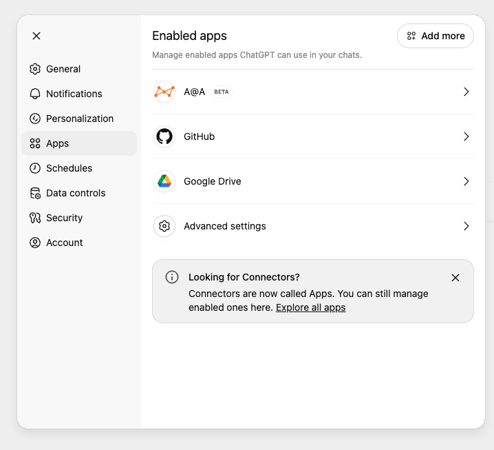

import { Steps } from '@astrojs/starlight/components';

Connect your Alation catalog to ChatGPT using the Remote MCP server with OAuth authentication.

:::note
This guide covers **Remote MCP** setup for ChatGPT web.
Developer mode is required to add custom MCP servers.
:::

## Prerequisites

- **OAuth Client credentials** from your Alation instance ([Create OAuth Client](/agent-studio-docs/guides/authentication/user_initiated_auth/))
- **ChatGPT paid subscription** (Plus, Pro, Business, Enterprise, or Edu)

## Enable developer mode

Developer mode is required to create custom apps/connectors.

<Steps>

1. **Open settings**

   Navigate to **Settings** → **Apps**.

   

2. **Enable developer mode**

   Click **Advanced settings**, then toggle on **Developer mode**.

   

   Once enabled, you'll see a **Create app** button on the Apps page.

   

</Steps>

## Adding the app

<Steps>

1. **Create a new app**

   Click **Create app** to open the New App form.

2. **Fill in the app details**

   

   | Field | Value |
   |-------|-------|
   | Name | `Alation MCP` (or your preferred name) |
   | Description | `Fetch content from Alation` (optional) |
   | MCP Server URL | `https://<YOUR_INSTANCE>.alationcloud.com/ai/mcp/` |
   | Authentication | Select **OAuth** |
   | Client ID | Your OAuth client ID |
   | Client Secret | Your OAuth client secret |

3. **Acknowledge the risk warning**

   Check the box next to "I understand and want to continue".

4. **Create the app**

   Click **Create**.

</Steps>

## Connecting (authentication)

<Steps>

1. **Sign in to Alation**

   A browser window opens to your Alation login page.
   Sign in with your credentials.

   

2. **Verify connection**

   After signing in, you'll see a green confirmation popup.
   The app now shows as connected with available actions.

   

</Steps>

## Using Alation in chat

To use Alation in a conversation, click the **+** button, then **More**, and select **Alation MCP**.

## Example prompts

Once connected, try queries like:
- "What tables do we have related to customer analytics?"
- "What are the commonly joined tables with customer_profile?"

## Troubleshooting

- **Don't see "Create app" button?** Make sure Developer mode is enabled in Settings → Apps → Advanced settings.
- **Connection failed?** Verify your OAuth Client ID and Secret are correct, and that your Alation instance is accessible.