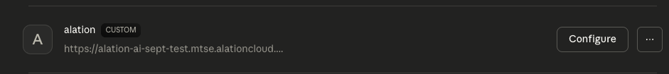

import { Steps } from '@astrojs/starlight/components';

Connect your Alation catalog to Claude (web, desktop, and mobile) using the Remote MCP server with OAuth authentication.

:::note
This guide covers **Remote MCP** setup (OAuth-based, no local installation). For local MCP server setup, see the [Local MCP Guide](https://github.com/Alation/alation-ai-agent-sdk/blob/main/guides/mcp/claude_desktop.md).
:::

## Prerequisites

- **OAuth Client credentials** from your Alation instance ([Create OAuth Client](/agent-studio-docs/guides/authentication/user_initiated_auth/))
- **Claude subscription**: Pro, Max, Team, or Enterprise

## Adding the Connector

<Steps>

1. **Open Connector Settings**

   - **Pro / Max plans:** Navigate to **Settings** → **Connectors**
   - **Team / Enterprise plans:** Navigate to **Admin Settings** → **Connectors** (Owners only)
   
   > For Team/Enterprise, only Primary Owners or Owners can add connectors. Users then individually connect and enable them.

2. **Add Custom Connector**

   Click **Add custom connector** at the bottom of the page.

   

   Fill in the following:

   | Field | Value |
   |-------|-------|
   | Name | `Alation` (or your preferred name) |
   | Remote MCP server URL | `https://<YOUR_INSTANCE>.alationcloud.com/ai/mcp/` |

   Expand **Advanced settings** and enter:

   | Field | Value |
   |-------|-------|
   | OAuth Client ID | Your client ID from Alation |
   | OAuth Client Secret | Your client secret from Alation |

   Click **Add**.

</Steps>

## Connecting (Authentication)

<Steps>

1. **Click Connect**

   Back on the Connectors page, find your Alation connector showing "Disconnected" status. Click **Connect**.

   

2. **Sign in to Alation**

   A browser window opens and redirects you to your Alation instance. Sign in with your Alation credentials.

   

   After signing in, the browser redirects back to Claude and your connector shows as connected.

</Steps>

## Enabling Tools

All tools are enabled by default after connecting. This section is optional if you want to toggle the connector or disable specific tools.

### Toggle the Connector On/Off

In a chat window, click the **+** button, then **Connectors** to see available connectors. Toggle **alation** on or off as needed.

### Configure Individual Tools

To disable or block specific tools:

1. Navigate to **Settings** → **Connectors**
2. Find your Alation connector and click **Configure**

   

3. Set permissions for individual tools:
      - **Always allow** - Tool runs without prompting
      - **Ask for approval** - Claude asks before using the tool
      - **Block** - Disables the tool

## Example Prompts

Once connected, try queries like:
- "What tables contain sales data?"
- "Tell me about Commission Model dashboard?"
- "Can you explain Classified columns SQL query in the catalog"

## Troubleshooting

- **"Connect" button spins or page loads forever?** The OAuth flow opens in your default browser. Make sure you're logged into claude.ai in that browser with the same account as Claude Desktop.