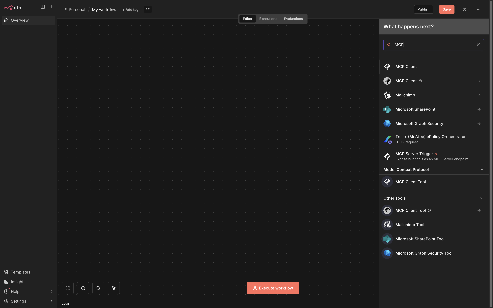
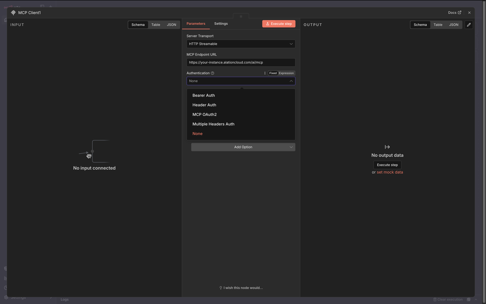
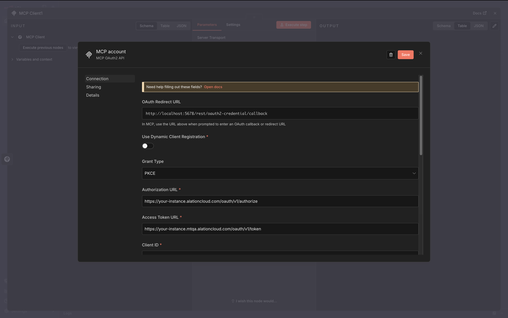
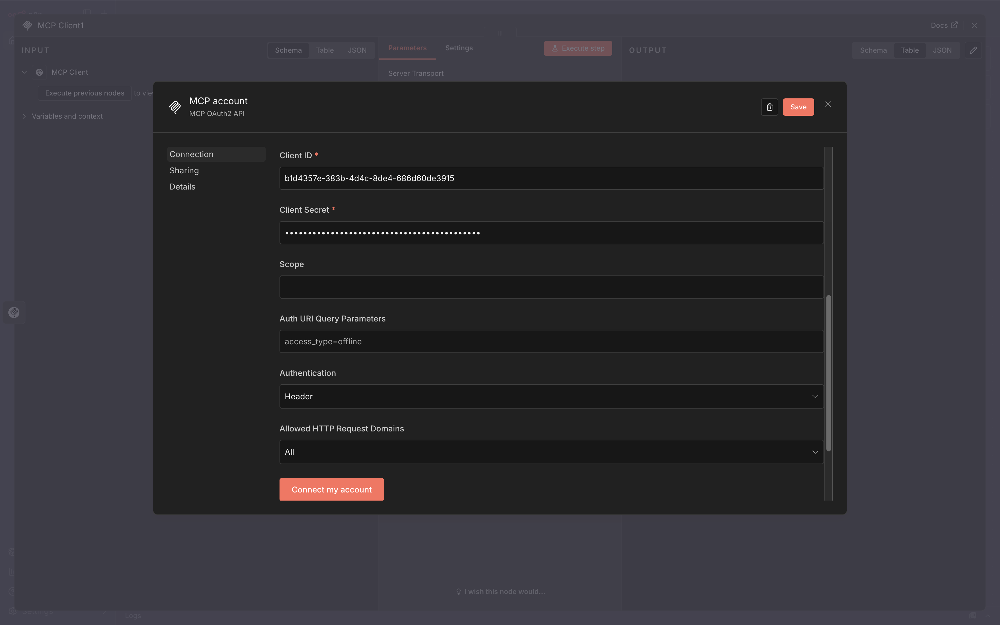
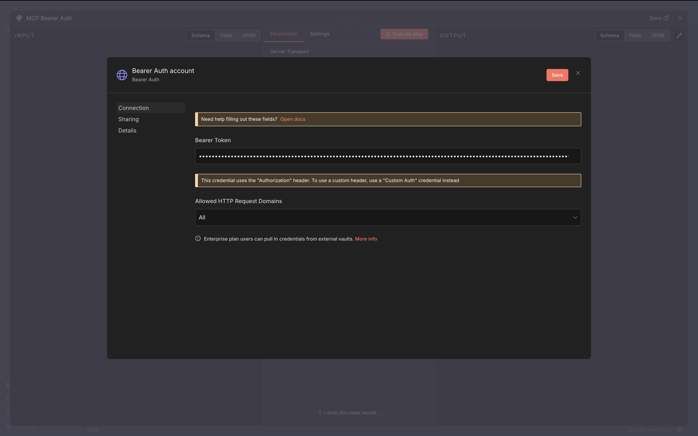
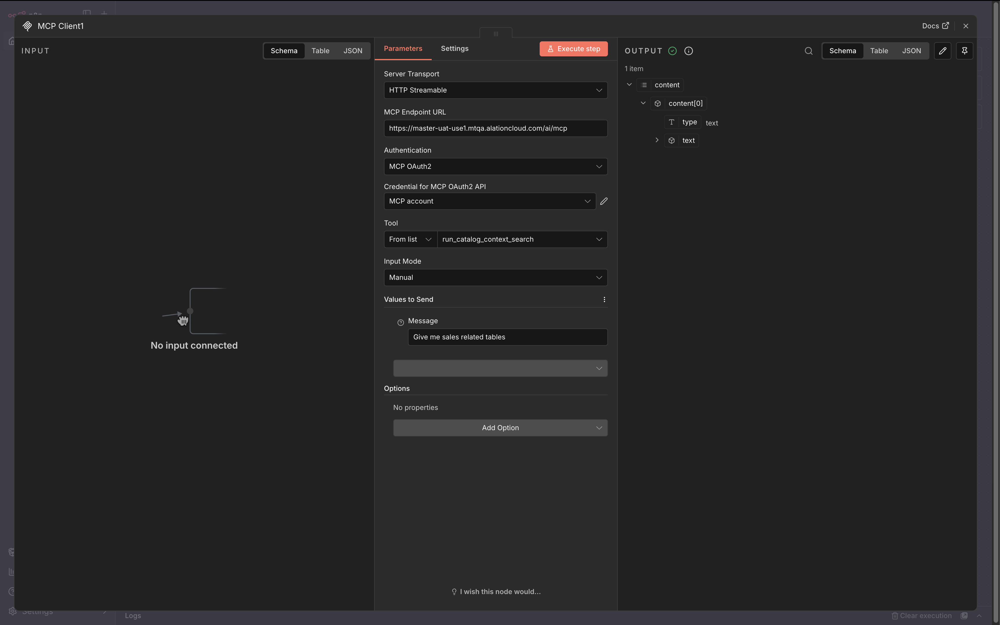

This guide shows you how to set up n8n's MCP Client Tool node to connect to your hosted Alation MCP server.
Local Alation MCP server integration is not covered in this guide.

## Prerequisites

- n8n instance with built-in [MCP Client Tool node](https://docs.n8n.io/integrations/builtin/cluster-nodes/sub-nodes/n8n-nodes-langchain.toolmcp/) support.
- OAuth Client credentials from your Alation instance or a Server Admin role to create one.

## Step 1. Add an MCP Client Node in n8n

Search for MCP Client Tool node.
In the screenshot below, you can see two types of MCP Client Tool nodes: first one is the built-in MCP Client node, and the second one is from the community package.
This guide will pick the built-in one which supports the OAuth 2.0 authentication method.

## Step 2. Configure authentication

1. Choose `HTTP Streamable` as Server Transport.
2. Enter `https://<your-instance>.alationcloud.com/ai/mcp` as the MCP Endpoint URL.
3. Alation hosted MCP Server supports Bearer Auth and MCP OAuth2.
   - MCP OAuth2: recommended for user delegated access.
   - Bearer Auth: used for service account style access. Note that the token needs to be manually refreshed when it expires.

### MCP OAuth2 setup

#### 1. Create an OAuth Client

Refer to the [OAuth 2.0 User Initiated Authentication Guide](/agent-studio-docs/guides/authentication/user_initiated_auth) to create an OAuth Client in your Alation instance.
The following fields are required when creating an OAuth Client for n8n.

| Field                | Value                                                                                                                  |
| -------------------- | ---------------------------------------------------------------------------------------------------------------------- |
| name                 | Any name to identify the client. e.g. `"n8n-mcp-client"`                                                               |
| client_type          | `"confidential"`                                                                                                       |
| redirect_uris        | Taken from the n8n oauth setup page. In the below example, `["http://localhost:5678/rest/oauth2-credential/callback"]` |
| refresh_token_expiry | Refresh token lifetime in seconds. e.g. `259200`                                                                       |
| access_token_expiry  | Access token lifetime in seconds. e.g. `3600`                                                                          |
| pkce_required        | `true`                                                                                                                 |

Securely store the `client_id` and `client_secret` as you will need them to configure the OAuth2 credentials in n8n.

#### 2. Configure OAuth2 credentials in n8n

Fill in the following fields in the n8n OAuth2 credential setup.

| Field                           | Value                                                         |
| ------------------------------- | ------------------------------------------------------------- |
| Use Dynamic Client Registration | Off                                                           |
| Grant Type                      | PKCE                                                          |
| Authorization URL               | `https://<your-instance>.alationcloud.com/oauth/v1/authorize` |
| Access Token URL                | `https://<your-instance>.alationcloud.com/oauth/v1/token`     |
| Client ID                       | `client_id` from the OAuth Client you created in Alation      |
| Client Secret                   | `client_secret` from the OAuth Client you created in Alation  |
| Scope                           | Leave blank                                                   |
| Auth URI Query Parameters       | Leave blank                                                   |
| Authentication                  | Header                                                        |
| pkce_required                   | `true`                                                        |

Click **Connect my account** to initiate the OAuth2 flow.
A new window will open to ask for your Alation login credentials.
Once the account is connected, **save** the configuration and exit.

### Bearer Auth setup

#### 1. Obtain an access token

Refer to the [OAuth 2.0 M2M Authentication Guide](/agent-studio-docs/guides/authentication/machine_to_machine) to create an OAuth Client in your Alation instance and obtain an access token.

#### 2. Configure Bearer Auth in n8n

Fill in the access token from the previous step into the Bearer Token field.

Click **Save** and exit.

## Step 3. Complete the node setup

Once the connection is set up, you will see the list of available tools.
Choose the tool you want to use in this node and fill in the input parameter values.
Click **Execute step** to test the tool call.

