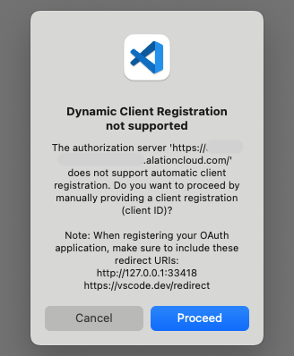
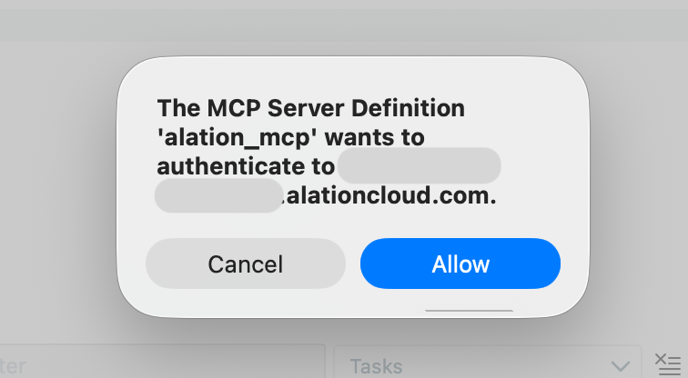
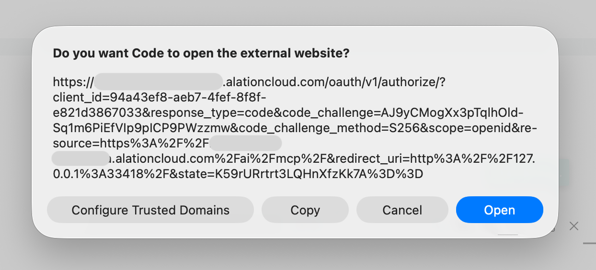
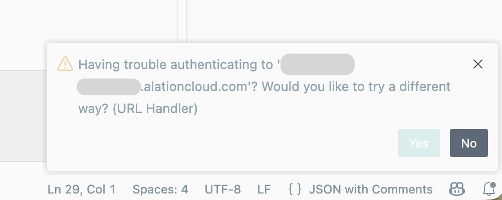
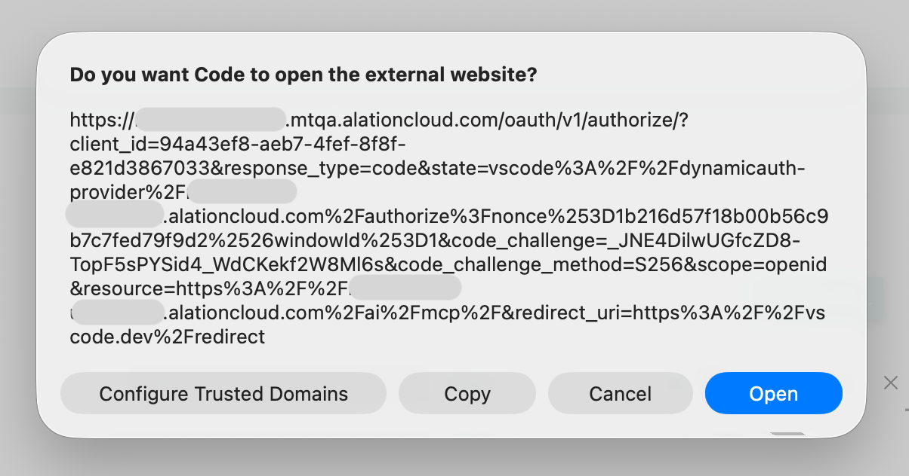
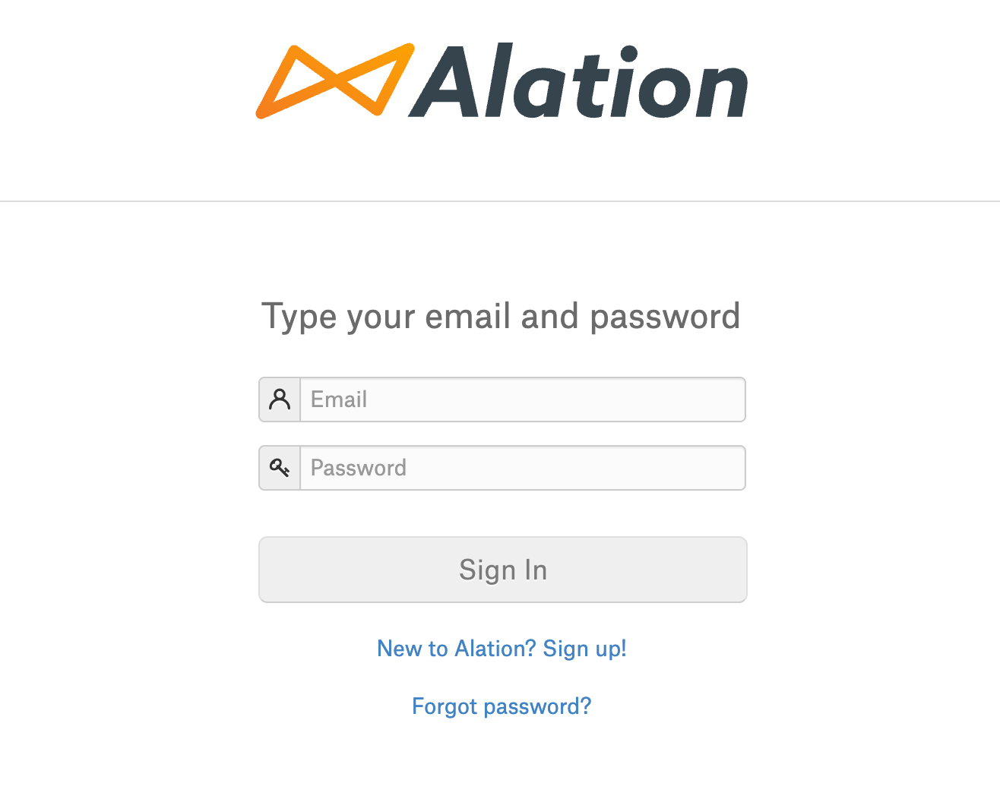
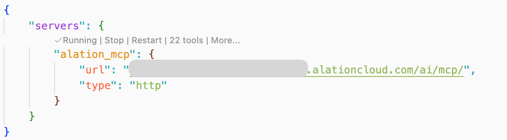

import { Steps } from '@astrojs/starlight/components';

Connect your Alation catalog to VS Code using the Remote MCP server with OAuth authentication.

:::note
This guide covers **Remote MCP** setup. For local MCP server setup, see the [Local MCP Guide](https://github.com/Alation/alation-ai-agent-sdk/blob/main/guides/mcp/code_editors.md).
:::

## Prerequisites

- **OAuth Client credentials** from your Alation instance, or a Server Admin role to register a new client.
- **VS Code** with MCP support enabled

## Create an OAuth Client for VS Code

Follow the [OAuth 2.0 User Initiated Authentication Guide](/agent-studio-docs/guides/authentication/user_initiated_auth) to create an OAuth Client in your Alation instance.
Use the following payload values when creating the OAuth Client (omit the `localhost` address suggested by VS Code).

```jsonc
{
  "name": "VS Code MCP Client",
  "client_type": "confidential",
  "redirect_uris": [
    "https://vscode.dev/redirect"
  ],
  "refresh_token_expiry": 259200,
  "access_token_expiry": 3600,
  "pkce_required": true
}
```

Securely store the `client_id` and `client_secret` values, they will be used during authentication.

## Adding the MCP Server

<Steps>

1. **Create the MCP server configuration file**

   In your project root, create a `.vscode` folder if it doesn't exist, then create (or open) `mcp.json` inside it.

2. **Add the Alation server configuration**

   ```jsonc
   {
     "servers": {
       "alation_mcp": {
         "url": "https://<YOUR_INSTANCE>.alationcloud.com/ai/mcp/",  // Replace with your Alation instance URL
         "type": "http"
       }
     },
     "inputs": []
   }
   ```

</Steps>

## Connecting (Authentication)

<Steps>

1. **Start the MCP server**

   In the `mcp.json` file, click **Start** above the server configuration.

   

2. **Proceed through Registration**

   A modal appears saying "Dynamic Client Registration not supported". Click **Proceed**.

   

3. **Enter your credentials**

   VS Code prompts you (sequentially) for `client_id` and `client_secret` from the OAuth Client you created.
   Paste each one, pressing **Enter** after each.

4. **Allow authentication**

   Click **Allow** when prompted that the MCP server wants to authenticate.

   

5. **Cancel the `localhost` authentication prompt**

   A modal asks to open an external website, with the redirect URI url-encoded to a value similar to `redirect_uri=http%3A%2F%2F127.0.0.1%3A33418%2F`.
   Click **Cancel** (or cancel via the toast in the bottom right-hand of VS Code if you clicked Open).

   

6. **Accept the `vscode` authentication prompt**
   
   A toast will appear in the bottom right-hand of VS Code asking "Having trouble authenticating?".
   Click **Yes**.
   
   

   Another external website modal appears with a new oauth link, with a redirect URI similar to `redirect_uri=https%3A%2F%2Fvscode.dev%2Fredirect`.
   Click **Open**.

   

7. **Sign in to Alation**

   Your browser opens the Alation login page. Sign in with your credentials.
   
   

8. **Verify connection**

   After signing in, VS Code shows the server as "Running" with a number of available tools.

   

</Steps>

## Enabling Tools

Tools are available once connected. Click the tool count (e.g., "XX tools") to open the Configure Tools panel and select which tools are available to chat.


## Example Prompts

Once connected, try queries like:
- "Use catalog context search agent and fetch all columns in the sales table" (You can also point to a specific tool and ask your questions like this)
- "What tables are related to customer data?"

## Troubleshooting

- **Stuck on "Authentication..."?** Restart VS Code and follow the authentication steps again.

- **Always showing localhost and never redirecting to your server?** Check Managed Trusted Domains and remove your Alation instance:
  1. **Cmd+Shift+P** (Mac) or **Ctrl+Shift+P** (Windows)
  2. Select `Manage Trusted Domains`
  3. Remove your Alation instance URL from the list
  4. Save and retry authentication

- **Need to rotate credentials?** Clear saved OAuth state:
  1. **Cmd+Shift+P** (Mac) or **Ctrl+Shift+P** (Windows)
  2. Select `Authentication: Remove Dynamic Authentication Providers`
  3. Check the Alation MCP server entry and click **OK**, then **Remove**
