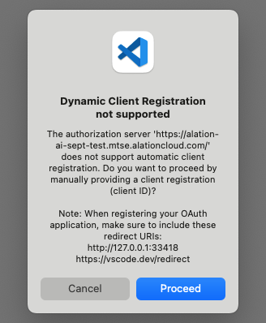
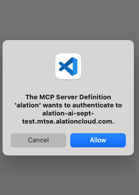
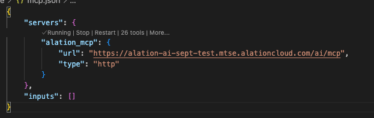
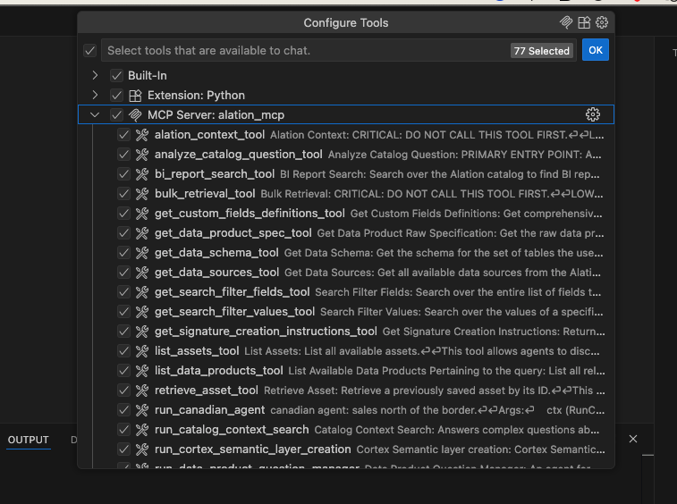

import { Steps } from '@astrojs/starlight/components';

Connect VS Code to your Alation catalog using the Remote MCP server with OAuth authentication.

:::note
This guide covers **Remote MCP** setup. For local MCP server setup, see the [Local MCP Guide](https://github.com/Alation/alation-ai-agent-sdk/blob/main/guides/mcp/code_editors.md).
:::

## Prerequisites

- **OAuth Client credentials** from your Alation instance ([Create OAuth Client](/guides/mcp_auth/create_oauth_client))
- **VS Code** with MCP support enabled

## Adding the MCP Server

<Steps>

1. **Create the configuration file**

   In your project root, create a `.vscode` folder if it doesn't exist, then create a file named `mcp.json` inside it.

2. **Add the Alation server configuration**

   ```jsonc
   {
     "servers": {
       "alation_mcp": {
         "url": "https://<YOUR_INSTANCE>.alationcloud.com/ai/mcp/",
         "type": "http"
       }
     },
     "inputs": []
   }
   ```

</Steps>

## Connecting (Authentication)

<Steps>

1. **Start the MCP server**

   In the `mcp.json` file, click **Start** above the server configuration.

   

2. **Proceed through Dynamic Client Registration**

   A modal appears saying "Dynamic Client Registration not supported". Click **Proceed**.

   

3. **Enter your credentials**

   VS Code prompts you for:
   - **Client ID** - Enter your OAuth client ID
   - **Client Secret** - Enter your OAuth client secret

   Press **Enter** after each.

4. **Allow authentication**

   Click **Allow** when prompted that the MCP server wants to authenticate.

   

5. **Cancel the first browser prompt**

   A modal asks to open an external website. Check the URL - if it contains `127.0.0.1`, click **Cancel**.

   

6. **Accept the second browser prompt**

   A toast appears asking "Having trouble authenticating?". Click **Yes**.

   Another external website modal appears. This time the URL contains `vscode.dev/redirect`. Click **Open**.

   

7. **Sign in to Alation**

   Your browser opens the Alation login page. Sign in with your credentials.

8. **Verify connection**

   After signing in, VS Code shows the server as "Running" with available tools.

   

</Steps>

## Enabling Tools

Tools are available once connected. Click the tool count (e.g., "26 tools") to open the Configure Tools panel and select which tools are available to chat.



## Example Prompts

Once connected, try queries like:
- "Use catalog context search agent and fetch all columns in the sales table" (You can also point to a specific tool and ask your questions like this)
- "What tables are related to customer data?"

## Troubleshooting

- **Stuck on "Authentication..."?** Restart VS Code and follow the authentication steps again.

- **Always showing localhost and never redirecting to your server?** Check Managed Trusted Domains and remove your Alation instance:
  1. **Cmd+Shift+P** (Mac) or **Ctrl+Shift+P** (Windows)
  2. Select `Manage Trusted Domains`
  3. Remove your Alation instance URL from the list
  4. Save and retry authentication

- **Need to rotate credentials?** Clear saved OAuth state:
  1. **Cmd+Shift+P** (Mac) or **Ctrl+Shift+P** (Windows)
  2. Select `Authentication: Remove Dynamic Authentication Providers`
  3. Check the Alation MCP server entry and click **OK**, then **Remove**