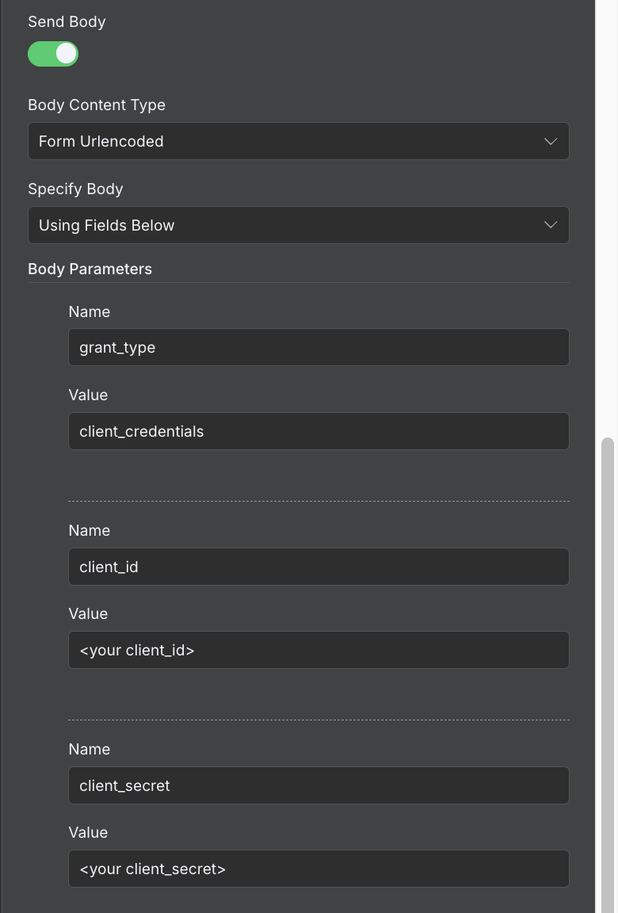
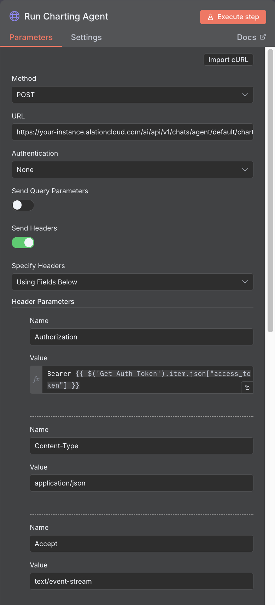
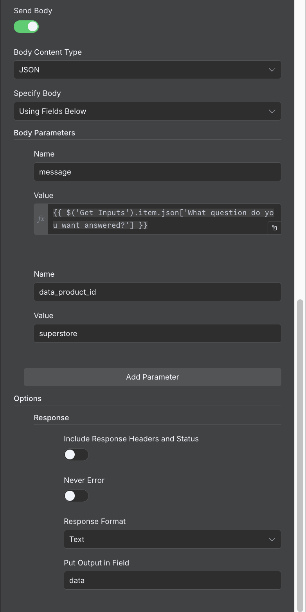

import { Steps } from "@astrojs/starlight/components";

This guide shows you how to set up an n8n workflow to call agents and tools in Agent Studio.

## Prerequisites

- n8n instance
- OAuth Client credentials from your Alation instance or a Server Admin role to create one.
- If calling SQL-executing agents (Query, Data Product Query, Analytics, Chart Generation), you must first [configure data warehouse credentials](/agent-studio-docs/guides/authentication/machine-to-machine/#configuring-data-warehouse-credentials).

## Step 1. Create an OAuth Client in Alation

Follow the [Authentication Guide](/agent-studio-docs/guides/authentication/machine-to-machine/) to create an OAuth 2.0 Client in your Alation instance.
Make sure to note down the `client_id` and `client_secret` as you will need them to obtain an access token.

## Step 2. Get an access token

We can use n8n's HTTP Request node to obtain an access token.

<Steps>

1. Add an HTTP Request node to your workflow.
2. Fill in the following fields to configure the node:

   | Field                 | Value                                                                                                  |
   | --------------------- | ------------------------------------------------------------------------------------------------------ |
   | Method                | POST                                                                                                   |
   | URL                   | https://[your-instance].alationcloud.com/oauth/v2/token/                                               |
   | Authentication        | None                                                                                                   |
   | Send Query Parameters | Off                                                                                                    |
   | Send Headers          | On                                                                                                     |
   | Header Parameters     | accept: application/json<br/>content-type: application/x-www-form-urlencoded                           |
   | Send Body             | On                                                                                                     |
   | Body Content Type     | Form Urlencoded                                                                                        |
   | Body Parameters       | grant_type: client_credentials<br/>client_id: [your-client-id]<br/>client_secret: [your-client-secret] |

   <details>
     <summary>Example configuration screenshots</summary>
     
     
   </details>

3. **Execute step** to test the node and obtain an access token.

</Steps>

## Step 3. Call an agent or a tool

<Steps>
1. Add another HTTP Request node to your workflow.
2. Fill in the following fields to configure the node:

    | Field                 | Value                                                                                                  |
    | --------------------- | ------------------------------------------------------------------------------------------------------ |
    | Method                | POST                                                                                                   |
    | URL                   | Agent/tool stream endpoint url                                                                         |
    | Authentication        | None                                                                                                   |
    | Send Query Parameters | Off                                                                                                    |
    | Send Headers          | On                                                                                                     |
    | Header Parameters     | Authorization: `Bearer {{ $('Get Auth Token').item.json["access_token"] }}`<br />Content-Type: application/json<br />Accept: text/event-stream        |
    | Send Body             | On                                                                                                     |
    | Body Content Type     | JSON                                                                                        |
    | Body Parameters       | Relevant input parameters for the agent/tool |
    | Response Option       | Response Format: Text<br/> Put Output in Field: data |

    <details>
     <summary>Example configuration screenshots</summary>
    
    
    </details>

3. **Execute step** to test the node and call the agent/tool.

</Steps>

## Step 4. Parse streamed responses

As of writing, n8n does not natively support parsing streamed responses.
To handle streamed responses, you can use a Code node to parse the data received from the HTTP Request node.

<Steps>
1. Add a Code in Javascript node to your workflow.
2. Add code to parse the streamed response.
    <details>
    <summary>Example code snippet to parse streamed responses</summary>
    ```javascript
    // Parse the complete streaming response from n8n HTTP Request node
    let streamText = '';

    if ($input.item.json && $input.item.json.data) {
      streamText = $input.item.json.data;
    } else if (typeof $input.item.json === 'string') {
      streamText = $input.item.json;
    } else if ($input.item.binary && $input.item.binary.data) {
      streamText = $input.item.binary.data.toString('utf-8');
    } else {
      return {
        error: 'Could not find stream text in response',
        csvAssetId: null,
        chartAssetId: null,
        chatId: null,
        hasCsvAsset: false,
        hasChartAsset: false
      };
    }

    let csvAssetId = null;
    let chartAssetId = null;
    let chatId = null;

    const lines = streamText.split('\n');
    for (const line of lines) {
      if (!line.trim() || line.startsWith(': ping')) continue;
      if (line.startsWith('data: ')) {
        const data = line.slice(6);
        if (data === '[DONE]') continue;
        try {
          const parsed = JSON.parse(data);
          if (parsed.chat_id && !chatId) chatId = parsed.chat_id;
          if (parsed.model_message && parsed.model_message.parts) {
            for (const part of parsed.model_message.parts) {
              if (part.part_kind === 'tool-return' && part.metadata) {
                for (const meta of part.metadata) {
                  if (meta.kind === 'sql' && meta.id) csvAssetId = meta.id;
                  if (meta.kind === 'chart' && meta.id) chartAssetId = meta.id;
                }
              }
            }
          }
        } catch (e) {}
      }
    }

    return {
      csvAssetId: csvAssetId,
      chartAssetId: chartAssetId,
      chatId: chatId,
      hasCsvAsset: !!csvAssetId,
      hasChartAsset: !!chartAssetId
    };
    ```
    </details>

3. **Execute step** to test the node and parse the streamed response.

</Steps>

## Step 5. Fetch assets (Optional)

If your agent/tool call returns asset IDs (e.g., CSV or Chart asset IDs), you can add additional Code nodes to fetch and process these assets as needed.

<details>
<summary>Example code snippet to fetch a CSV asset</summary>

```javascript
// n8n Function node

const DEFAULT_HOST = "https://[your-instance].mtse.alationcloud.com";
const token = (() => {
  try {
    return $("Get Auth Token").first().json.access_token;
  } catch {
    return undefined;
  }
})();

const envBase = $env.ALATION_BASE_URL; // optional

const buildBase = (b) => {
  let u = (b || envBase || DEFAULT_HOST).replace(/\/+$/, "");
  if (!/\/ai\/api\/v1\/assets$/.test(u)) u += "/ai/api/v1/assets";
  return u;
};

const toRecords = (items) => {
  const out = [];
  for (const it of items) {
    const payload = it.json ?? it;
    if (Array.isArray(payload)) out.push(...payload);
    else out.push(payload);
  }
  return out;
};

const preview = (s) =>
  s ? String(s).slice(0, 80) + (String(s).length > 80 ? "…" : "") : "(empty)";

const incoming = $input.all();
const records = toRecords(incoming);
const results = [];

for (const rec of records) {
  const base = buildBase(rec.baseUrl);
  const chatId = rec.chatId;

  let csvContent = null;
  let chartBase64 = null;
  let csvStatus = null;
  let chartStatus = null;
  let csvErr = null;
  let chartErr = null;

  // --- CSV: fetch if we have an id + chatId (ignore hasCsvAsset flag) ---
  if (rec.csvAssetId && chatId) {
    const csvUrl = `${base}/${rec.csvAssetId}?chat_id=${chatId}`;
    try {
      const resp = await this.helpers.request({
        method: "GET",
        url: csvUrl,
        headers: token ? { Authorization: `Bearer ${token}` } : {},
        json: false,
        resolveWithFullResponse: true, // to capture status + headers
      });
      csvStatus = resp.statusCode;
      // treat only 2xx as success
      if (csvStatus >= 200 && csvStatus < 300) {
        const body = resp.body !== undefined ? resp.body : "";
        csvContent = typeof body === "string" ? body : String(body);
      } else {
        csvErr = `HTTP ${csvStatus}`;
        console.log("[CSV ERROR]", rec.csvAssetId, csvErr);
      }
    } catch (e) {
      csvErr = e.message || String(e);
      console.log("[CSV ERROR]", rec.csvAssetId, csvErr);
    }
  }

  // --- CHART: fetch if we have an id + chatId (ignore hasChartAsset flag) ---
  if (rec.chartAssetId && chatId) {
    const chartUrl = `${base}/${rec.chartAssetId}?chat_id=${chatId}`;
    try {
      const resp = await this.helpers.request({
        method: "GET",
        url: chartUrl,
        headers: token ? { Authorization: `Bearer ${token}` } : {},
        encoding: null, // Buffer for binary
        json: false,
        resolveWithFullResponse: true,
      });

      chartStatus = resp.statusCode;
      const headers = resp.headers || {};
      const ct = (headers["content-type"] || "").toLowerCase();
      const body = resp.body !== undefined ? resp.body : null;

      console.log(
        "[CHART]",
        rec.chartAssetId,
        "status:",
        chartStatus,
        "content-type:",
        ct || "(unknown)",
        "isBuffer:",
        Buffer.isBuffer(body)
      );

      if (chartStatus < 200 || chartStatus >= 300) {
        chartErr = `HTTP ${chartStatus}`;
      } else if (!body) {
        chartErr = "Empty body";
      } else if (ct.includes("application/json")) {
        const text = Buffer.isBuffer(body)
          ? body.toString("utf8")
          : String(body);
        try {
          const parsed = JSON.parse(text);
          chartBase64 = parsed.data || parsed.base64 || parsed.content || null;
          if (!chartBase64) chartErr = "JSON did not contain base64";
          console.log(
            "[CHART] base64(from JSON) len:",
            chartBase64 ? chartBase64.length : 0
          );
        } catch (e) {
          chartErr = `JSON parse failed: ${e.message}`;
          console.log("[CHART ERROR]", chartErr);
        }
      } else if (ct.startsWith("text/")) {
        const text = Buffer.isBuffer(body)
          ? body.toString("utf8")
          : String(body);
        chartBase64 = text.trim();
        console.log("[CHART] base64(text) len:", chartBase64.length);
      } else {
        const buf = Buffer.isBuffer(body) ? body : Buffer.from(body);
        chartBase64 = buf.toString("base64");
        console.log("[CHART] base64(from binary) len:", chartBase64.length);
      }
    } catch (e) {
      chartErr = e.message || String(e);
      console.log("[CHART ERROR]", rec.chartAssetId, chartErr);
    }
  }

  results.push({
    json: {
      csvContent,
      chartBase64,
      hasCsv: !!csvContent,
      hasChart: !!chartBase64,
      csvAssetId: rec.csvAssetId,
      chartAssetId: rec.chartAssetId,
      chatId,
      _baseUsed: base,
      _csvUrl:
        rec.csvAssetId && chatId
          ? `${base}/${rec.csvAssetId}?chat_id=${chatId}`
          : null,
      _chartUrl:
        rec.chartAssetId && chatId
          ? `${base}/${rec.chartAssetId}?chat_id=${chatId}`
          : null,
      _csvStatus: csvStatus,
      _chartStatus: chartStatus,
      _csvError: csvErr,
      _chartError: chartErr,
    },
  });
}

return results;
```

</details>

## Run the end to end workflow

Chain the nodes together to create an end to end workflow that calls an agent/tool and processes the response.

