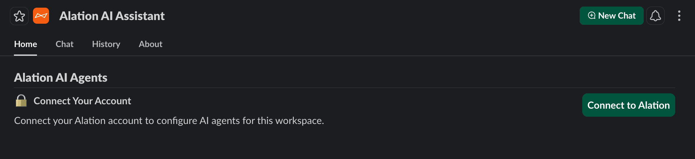
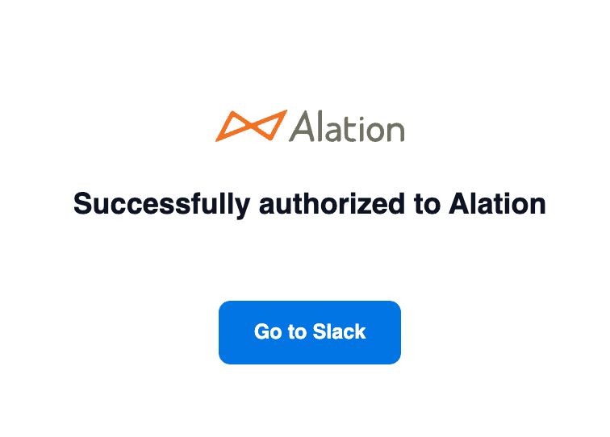
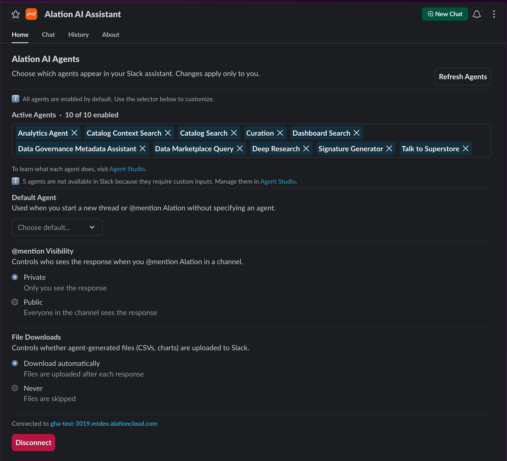
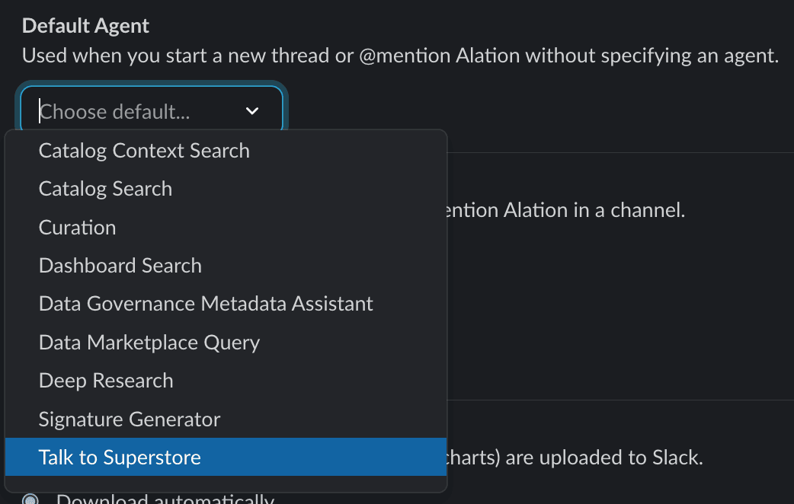

import { Steps } from '@astrojs/starlight/components';

The Alation AI Assistant brings your Alation AI agents into Slack.
You can chat with agents in DMs, @mention them in channels, and configure which agents are available from the App Home tab.

## Walkthrough

This video covers connecting your Alation account, picking agents, and asking your first question.

<video controls width="100%" preload="metadata">
  <source src="/agent-studio-docs/videos/slack-walkthrough.webm" type="video/webm" />
</video>

The rest of this page walks through each step in detail.

## Prerequisites

- An Alation Cloud instance with Agent Studio agents published
- A Slack workspace where you can install apps
- An install URL from your Alation admin (the app is in private preview)

## Installing the app

:::note
This step requires **Slack workspace admin** permissions.
If you're not an admin, ask your Slack workspace admin to install the app, then skip ahead to [Connecting your Alation account](#connecting-your-alation-account).
:::

<Steps>

1. Open the install URL in your browser.
   Slack shows the permission consent screen for your workspace.

   

   Review the permissions and click **Allow**.

2. Enter your company's Alation domain (the part before `.alationcloud.com`).

   

   Click **Continue**.

3. You should see the success confirmation.

   

   Click **Go to Slack** to return to your workspace.

</Steps>

## Connecting your Alation account

:::tip[Everyone does this step]
The install above is a one-time admin action. Everything from here on is per-user — each person in the workspace connects their own Alation account.
:::

<Steps>

1. Open the Alation AI Assistant in Slack and go to the **Home** tab.

   

   Click **Connect to Alation**.

2. Sign in with your Alation credentials if prompted.
   After authorizing, you should see the confirmation page.

   

   Click **Go to Slack**.

</Steps>

:::tip
If the Home tab still shows "Connect Your Account" after returning to Slack, press **Ctrl+R** (or **Cmd+R** on Mac) to refresh.
:::

## Authentication and permissions

When you connect your Alation account from the Home tab, the Slack app logs in as you.
It inherits your Alation permissions — if you can run an agent in Agent Studio, you can run the same agent in Slack (as long as it's compatible).

:::caution[Data product SSO credentials]
Some agents connect to data products that require SSO authentication.
These credentials are established when you first use the agent in Agent Studio.
Slack cannot initiate SSO flows — if your SSO session has expired, you'll need to re-authenticate by running the agent once in [Agent Studio](https://developer.alation.com), then return to Slack.
:::

## Configuring your agents

After connecting, the Home tab shows your agent settings.
All settings are per-user, so your choices don't affect anyone else in the workspace.

### Active agents

By default, all compatible agents are enabled.
Deselect any you don't want in your assistant threads or @mention responses.

:::note[Which agents appear in Slack?]
The Slack integration currently supports message-only interactions.
An agent appears here only if it has no required parameters beyond the message itself.
Agents with optional parameters still show up, but those extra fields are skipped — only your message gets sent.

If an agent needs a required input like a data product ID, it won't be listed.
You can still use it in [Agent Studio](https://developer.alation.com).
:::

### Default agent

Pick the agent that gets used when you start a new conversation or @mention the assistant without specifying one.

### @mention visibility

Controls who sees the response when you @mention the assistant in a channel:

- **Private** (default) — only you see the response, sent as a DM
- **Public** — everyone in the channel sees the response in the thread

### File downloads

Controls whether agent-generated files (CSVs, charts) are uploaded to Slack after each response:

- **Download automatically** (default) — files appear in the thread
- **Never** — files are skipped, but the response tells you they're available
