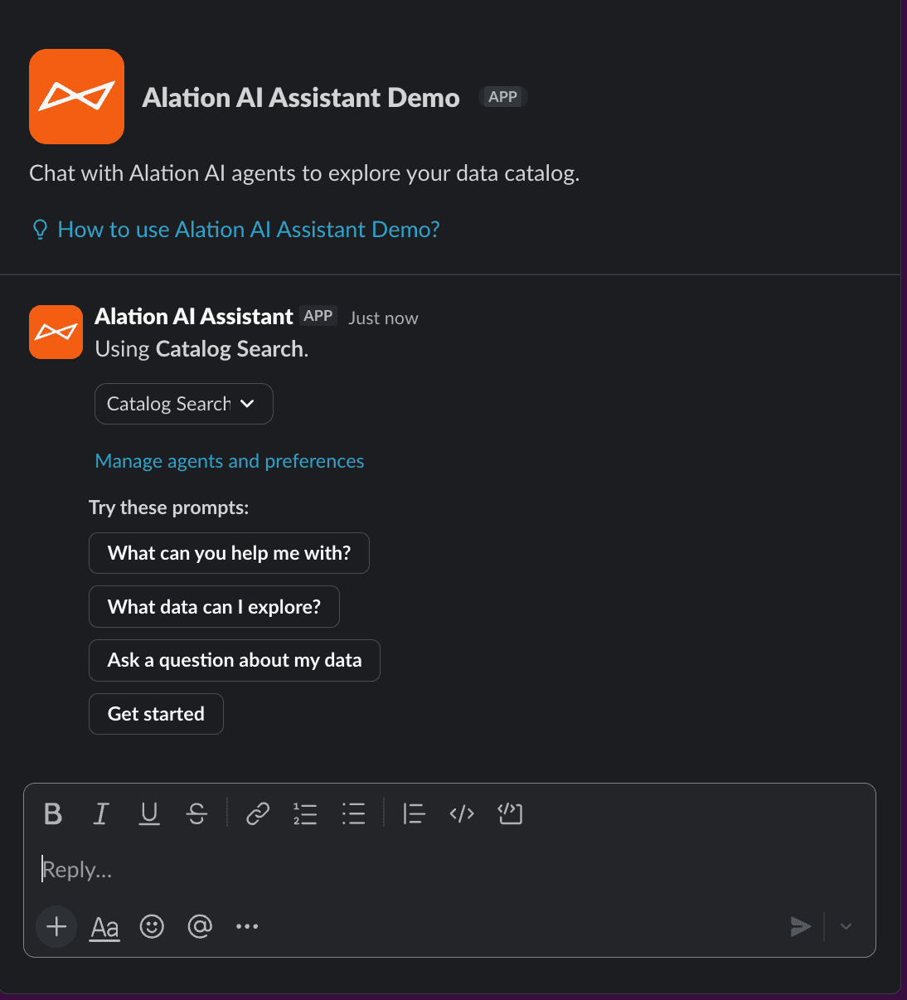
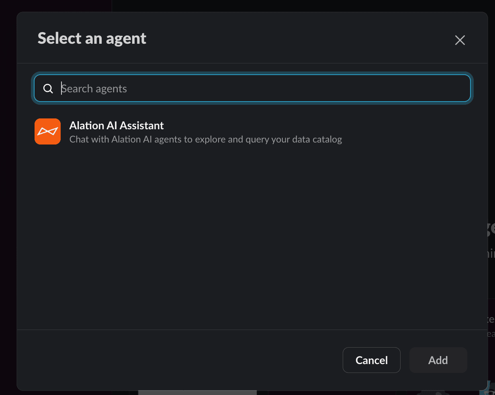
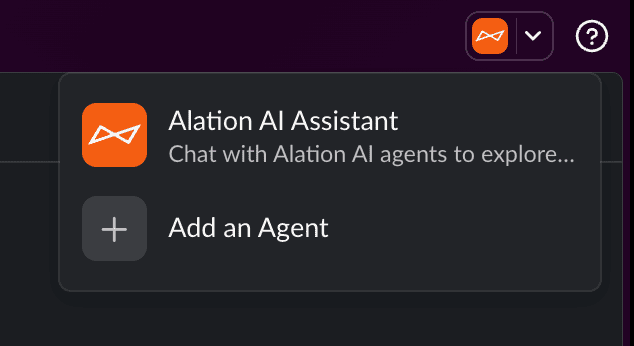
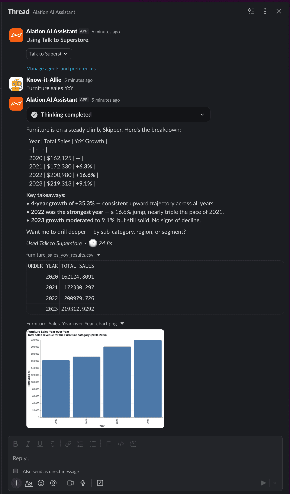
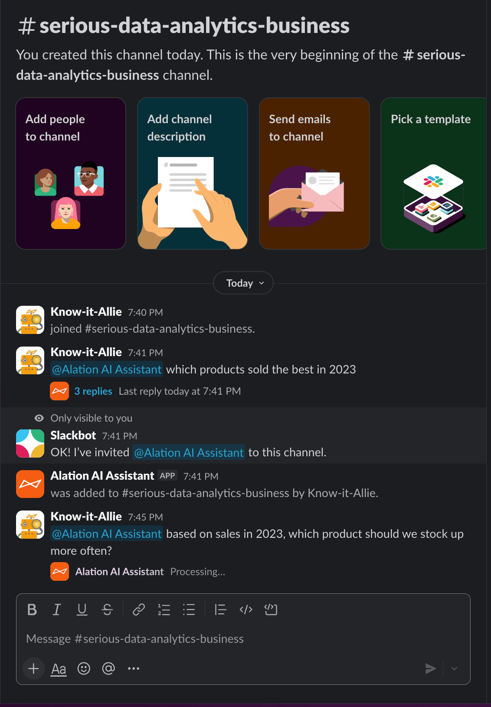
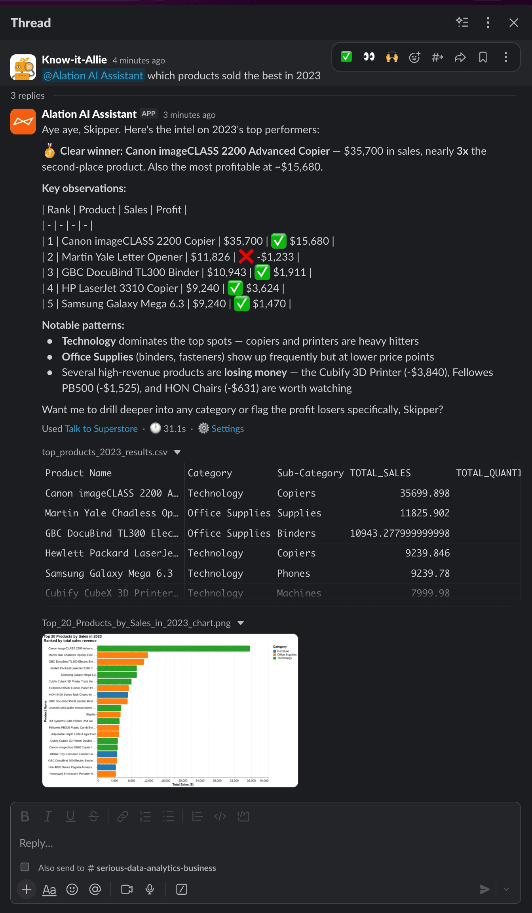
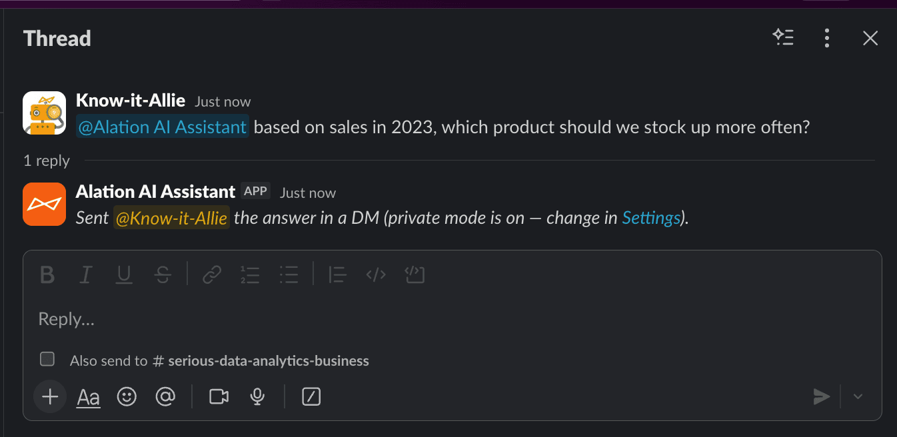
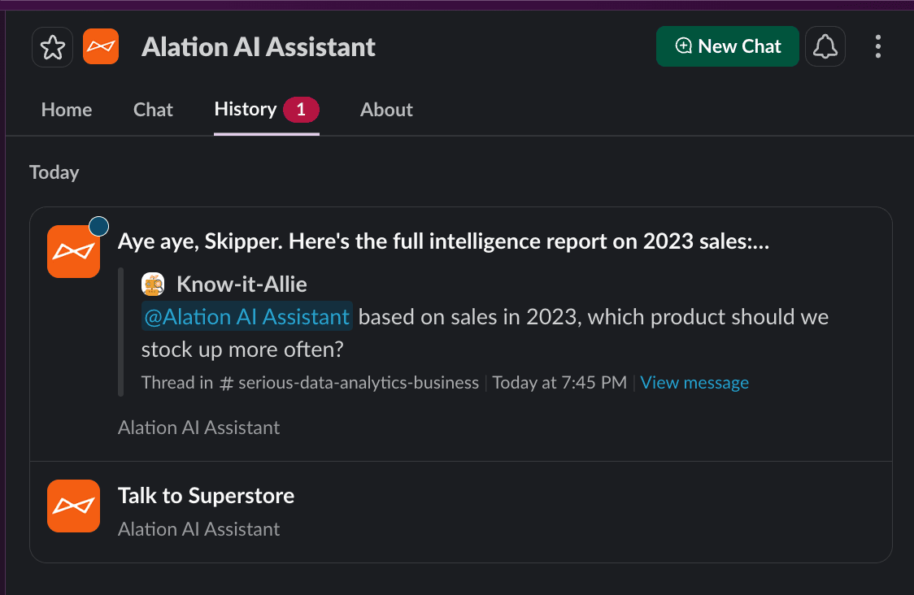

Once you've [installed and configured](/agent-studio-docs/guides/slack/setup/) the Alation AI Assistant, you're ready to start asking questions.

## Try it now

The fastest way to get started: type `@Alation AI Assistant` in any Slack channel followed by a question.

For example:
> `@Alation AI Assistant what tables have revenue data?`

The assistant uses your default agent and replies in the thread. That's it.

## Three ways to chat

| Method | Best for | Context |
|--------|----------|---------|
| **@mention in a channel** | Quick questions where you're already working | Each thread is a separate conversation. New @mention = fresh context. |
| **Direct message** | Longer back-and-forth exploration | Continuous conversation within the thread. |
| **Agent menu** (top-right) | Starting a DM without finding the app first | Same as DM. |

## Direct messages

Open a DM with the Alation AI Assistant.
The assistant starts a thread with your default agent selected and shows suggested prompts to get you started.

Click a prompt or type your own question. The agent responds in the same thread.
Follow-up questions carry context, so the agent remembers what you've already discussed.

### Switching agents

To change agents mid-conversation, use the dropdown at the top of the thread.
The switch only applies to the current thread — it doesn't change your default agent.

### Starting from the agent menu

You can also start a conversation from Slack's agent selector in the top-right corner, or by searching in the "Select an agent" dialog.

## Channel @mentions

Type `@Alation AI Assistant` followed by your question in any channel.
The assistant gets auto-invited if it's not already in the channel.

### What the response looks like

The assistant shows a processing indicator while the agent works.

Responses can include formatted tables, analysis, CSV file attachments, and chart images.
Each response shows the agent name and processing time at the bottom, with a link to Agent Studio.

### Conversation context

- **Same thread:** the agent remembers earlier messages, so follow-ups work.
- **New @mention outside a thread:** starts a fresh conversation with no prior context.
- **Agent selection:** your default agent (from the Home tab) is used for all @mentions.

### Private vs public responses

By default, @mention responses are **private** — the assistant posts a short notice in the channel and sends the full answer to your DMs.

Change this to **Public** in the [Home tab settings](/agent-studio-docs/guides/slack/setup/#mention-visibility) if you want everyone in the channel to see the response.

## Chat history

The **History** tab in the app shows your past conversations from both DMs and channel @mentions.

Click any conversation to jump back to the original thread.
