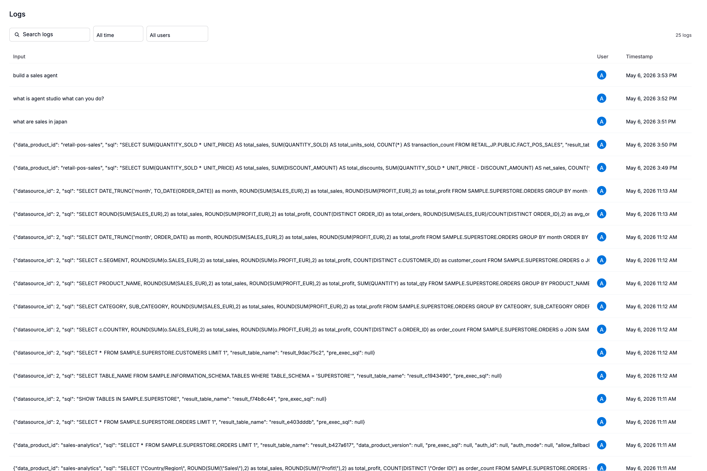
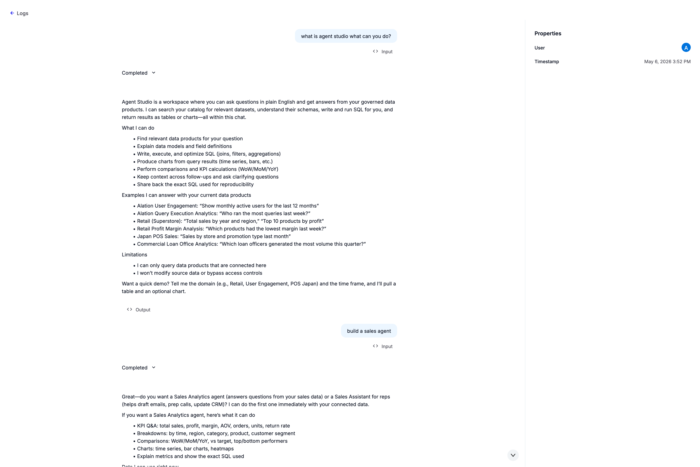

import { Aside } from '@astrojs/starlight/components'

The Logs page provides a detailed view of every individual AI interaction in your tenant. While the [Usage page](../usage/) shows aggregated counts, the Logs page shows each conversation turn with full context — what the user asked, how the agent responded, whether an error occurred, and what feedback the user gave.

<Aside type="note">
The Logs page is only accessible to **Server Admins** to protect sensitive message content and user activity data.
</Aside>

## Overview

Each row on the Logs page represents a single AI interaction — one question from a user and one response from an agent. This gives you the granularity needed to investigate specific issues, review quality, and understand user behavior.

## What each column means

| Column | What it shows |
|--------|--------------|
| **Timestamp** | When the interaction occurred |
| **User** | Who triggered the interaction (shown as user ID or email) |
| **Chat session** | Which conversation this interaction belongs to — useful for seeing multi-turn context |
| **Response type** | How the agent responded (see below) |
| **Intent** | What the user was trying to accomplish (see below) |
| **Error** | Whether the interaction failed |
| **Protocol** | Whether the request came via the UI/API (`http`) or an MCP client (`mcp`) |
| **Product area** | Which Alation product generated this interaction |
| **Tier** | Whether this was `free` or `paid` usage |
| **Sentiment** | User feedback if given — thumbs up (`positive`) or thumbs down (`negative`) |
| **Events** | What happened during this request — which tools were called, how many times |

### Response types

The agent classifies each response into one of these categories:

| Type | What it means |
|------|---------------|
| **RAG answer** | The agent retrieved context from the catalog and generated an answer grounded in real data |
| **Connector troubleshoot** | The agent helped diagnose a connector issue |
| **Discovery** | The agent helped the user find catalog objects (search, browse) |
| **Content** | The agent returned authored content such as documentation or descriptions |
| **Analytics** | The agent answered with computed results or charts from a data product |
| **Escalation** | The interaction was routed to a human or out-of-scope handler |
| **Curation** | The agent edited or proposed edits to catalog metadata |
| **Lineage debug** | The agent traced lineage to investigate where data came from |
| **RPD** | The agent assisted with a recommended product decision flow |
| **Secure Cloud** | The agent answered a Secure Cloud–specific question |
| **Direct** | The agent answered directly from its knowledge without needing to search the catalog |
| **Error** | Something went wrong and the agent couldn't produce a useful response |

### Intent categories

The system classifies what the user was trying to do:

| Intent | What it means |
|--------|---------------|
| **How-to** | The user asked how to accomplish something (e.g., "How do I create a data product?") |
| **Troubleshooting** | The user reported a problem (e.g., "My connector is failing with timeout errors") |
| **Conceptual** | The user asked for an explanation (e.g., "What is a trust flag?") |

### Events breakdown

Each log entry includes a list of events that occurred during that interaction. For example, a single interaction might show:

- `search_catalog` (tool) × 2 — the agent searched the catalog twice
- `get_data_schema` (tool) × 1 — the agent retrieved a schema
- `alamigo` (agent) × 1 — one agent run

This helps you understand the cost and complexity of individual interactions.

## Viewing conversation content

When you expand a log entry, you can see:

- **User query** — the exact question the user typed
- **AI response** — the full text of the agent's reply

<Aside type="note">
Message content is stored encrypted and only decrypted when you choose to view it. This protects user privacy while still allowing administrators to review interactions when needed.
</Aside>

## Filtering

You can narrow the Logs page by:

| Filter | Use it to... |
|--------|-------------|
| **Chat session** | See all interactions within a single conversation |
| **Response type** | Find only errors, only RAG answers, etc. |
| **Error flag** | Quickly isolate failed interactions |
| **Time range** | Focus on a specific period (e.g., "last Tuesday when the spike happened") |

## Common use cases

### Investigating usage spikes

When you see an unexpected spike on the Usage page, switch to the Logs page for the same time range. You can see exactly which users triggered the spike, what questions they asked, and which tools were invoked. This is the primary way to answer questions like "Was this spike from Ask Alation or from Agent Studio?"

### Reviewing quality

Filter by negative sentiment to find interactions where users gave a thumbs-down. Review the user's question and the agent's response to identify patterns — are users asking questions the agent isn't equipped to handle? Is context missing from the catalog?

### Error diagnosis

Filter by `is_error = true` to see all failed interactions. Each entry includes a trace ID that can be shared with your support team for deeper investigation.

### Understanding adoption

Review who is using AI features, what they're asking, and how they're interacting. The intent category and response type columns give you a high-level picture without needing to read every message.

## Permissions

| Role | Access |
|------|--------|
| **Server Admin** | Full access to all interaction logs, including message content |
| **All other roles** | No access to the Logs page |
