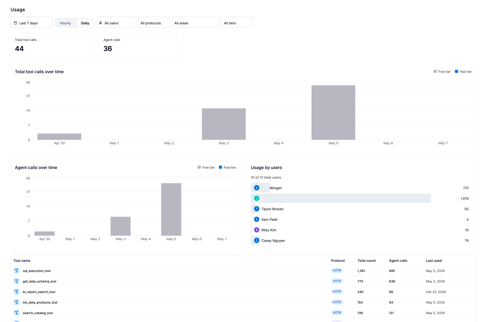
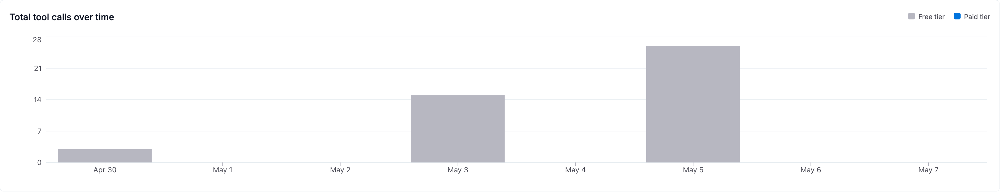
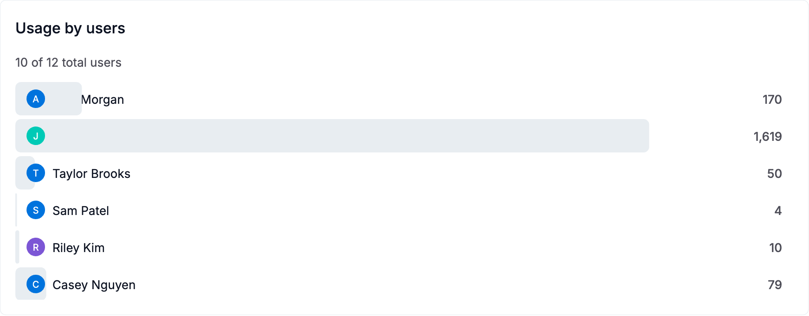
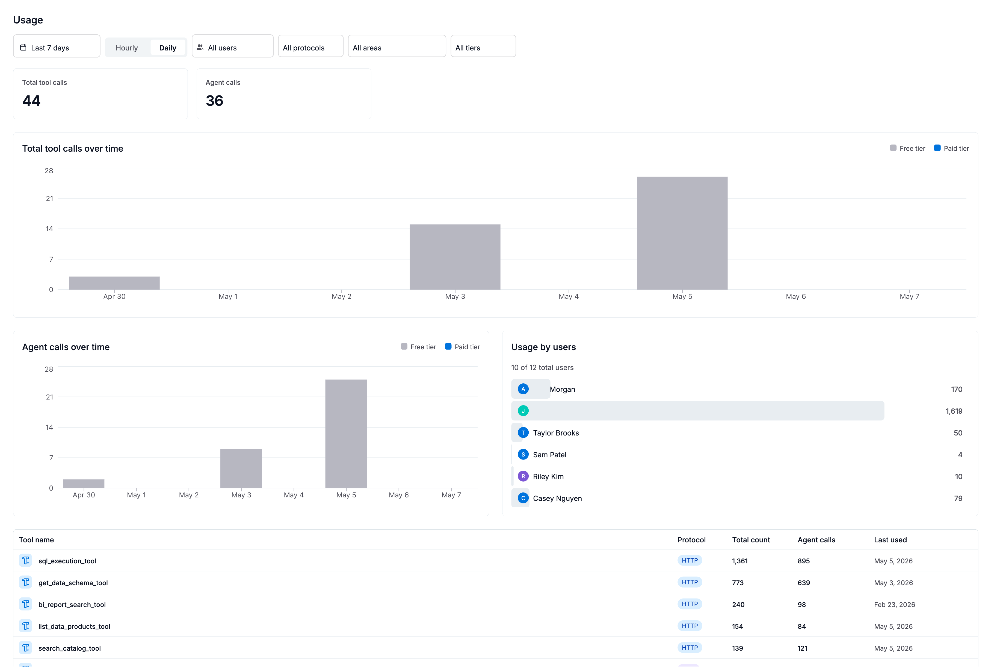

import { Aside } from '@astrojs/starlight/components'

The Usage page gives you a clear picture of how your organization is using AI features in Agent Studio. It answers questions like: *How many tool calls were made this month? Which agents are most popular? Are we approaching our quota?*

## How consumption is priced

Alation's AI products are priced in **Alation Consumption Units (ACUs)** — a single currency you buy as one pool and spend across all AI-powered products, rather than per seat.

| | |
|---|---|
| **Agent Studio rate** | 0.25 ACU per metered action |
| **What's a metered action** | Each distinct LLM call or tool invocation an agent makes during a workflow |
| **What's free** | Passive activity — browsing, searching, reading, and manual edits never cost ACUs |

Because most agent requests make [2–3 tool calls](/agent-studio-docs/get-started/key-concepts/#tool-calls-actions-and-usage-metering), a typical request costs roughly 0.5–0.75 ACU; a complex multi-step run costs more.

<Aside type="note" title="Source of truth for rates">
Rates and the shared-pool model are defined in [Alation Consumption Units](https://docs.alation.com/en/latest/admins/AdminSettings/AlationConsumptionUnit.html) in the admin docs. Confirm current pricing there or with your account team before budgeting.
</Aside>

### Watching your ACU pool

An admin (Server Admin or Catalog Admin) tracks the org-wide ACU balance on the **Consumption Dashboard** at **Admin Settings → User Management → Consumption Dashboard**. It refreshes daily and shows consumption trends, a per-product breakdown, and the remaining pool balance.

Alation warns at **80%** and **90%** of the pool. When ACUs run out, new metered actions are disabled — the affected buttons gray out with a tooltip explaining why.

The Usage page below is the Agent Studio-specific view of that consumption: every agent run, tool call, and action, with the filters to break it down.

## Overview

The Usage page shows **aggregated counts** of every AI interaction in your tenant — every agent run, every tool call, and every backend action (such as LLM calls or SQL queries). Data is broken down by time period so you can spot trends, identify spikes, and understand adoption patterns.

<Aside type="tip">
The Usage page is accessible to all users. Server Admins see data for the entire tenant. Non-admin users see only their own usage.
</Aside>

## What each column means

### Metric type

Every interaction is classified into one of three types:

| Type | What it represents |
|------|-------------------|
| **Agent** | A complete agent run — the agent received a prompt, reasoned, called tools, and produced a response |
| **Tool** | A single tool call made by an agent (e.g., searching the catalog, executing a query, fetching a data source) |
| **Action** | A backend operation that supports the AI — LLM inference calls, Alation API lookups, SQL query execution |

A single agent run typically triggers multiple tool calls and actions. For example, asking an agent to "find revenue tables" might generate 1 agent run, 3 tool calls (search catalog, get data schema, get object fields), and 2 actions (LLM calls).

### Metric name

The specific name of the agent, tool, or action. Examples:

- Agent names: `sql_query_agent`, `catalog_context_search`, `charting`
- Tool names: `search_catalog`, `execute_query`, `get_data_sources`
- Action names: `query`, `search`, `data_source`

### Protocol

How the interaction was triggered:

| Protocol | Meaning |
|----------|---------|
| **HTTP** | A call from the Agent Studio UI or a direct REST API integration |
| **MCP** | A call from an MCP client (Claude Desktop, Cursor, VS Code, etc.) |

This helps you understand where your usage is coming from — internal UI users vs. external MCP integrations.

### Product area

Which Alation product triggered the usage:

| Product area | Description | Counts against quota? |
|--------------|-------------|----------------------|
| **Agent Studio** | Direct usage via Agent Studio UI or API | Yes |
| **Unknown** | Requests where no product area was specified | Yes |
| **Catalog Search** | AI-powered search in the Alation catalog | No |
| **Data Product Marketplace** | Data product generation and evaluation | No |
| **Alamigo** | The Alamigo virtual support assistant | No |
| **Curation Hub** | AI-assisted curation workflows | No |
| **Critical Data Manager** | Critical data management workflows | No |

<Aside type="note">
Only **Agent Studio** and **Unknown** count against your usage quota. All other product areas are internal Alation features that are exempt — they do not consume your allocation even though they appear in the usage data.
</Aside>

### Tier

The pricing tier that was active when usage occurred:

| Tier | Meaning |
|------|---------|
| **Free** | Usage counting against your one-time free grant (never resets) |
| **Paid** | Usage on an active subscription (resets monthly) |

## Time periods

Usage is shown at three levels of detail:

| Granularity | What it shows | Best for |
|-------------|---------------|----------|
| **Hourly** | Counts per hour | Investigating specific spikes |
| **Daily** | Counts per day | Week-over-week trends |
| **Monthly** | Counts per month | Billing and capacity planning |

Each time bucket shows two numbers:

- **Count** — total number of invocations
- **Unique requests** — how many distinct user requests generated those invocations

<Aside type="tip">
If you see a high count but low unique requests, it means a small number of requests are triggering many tool calls each — typical of complex multi-step agent workflows like deep research or data product generation.
</Aside>

## Understanding your quota

Agent Studio enforces usage limits based on your plan:

- **Free tier** — a one-time cumulative grant of tool calls that never resets. Once exhausted, tool calls are blocked until you upgrade.
- **Paid tier** — a monthly allocation that resets at the start of each billing period.

Only **tool calls** from quota-applicable product areas (Agent Studio and Unknown) count against your limit. Agent runs and actions do not consume quota directly.

<Aside type="caution">
When your quota is exhausted, AI features will show an error indicating your plan limit has been reached. Contact your Alation account team to upgrade your plan or purchase additional capacity.
</Aside>

## Filtering the view

You can narrow what you see on the Usage page by:

- **User** — see a specific person's usage (admins only)
- **Metric type** — focus on just agents, tools, or actions
- **Protocol** — compare MCP vs. HTTP usage
- **Product area** — isolate Agent Studio usage from internal features
- **Tier** — view only free or paid consumption
- **Time granularity** — switch between hourly, daily, or monthly views

## Common questions

**Why do I see usage I didn't initiate?**
Some product areas (Catalog Search, Alamigo, Curation Hub) use AI features on your behalf as part of normal product operation. These show up in usage data but do not count against your quota.

**Why is there a delay before my usage appears?**
Usage events are aggregated periodically (typically within a few minutes). Very recent activity may not appear immediately.

**What's the difference between "count" and "unique requests"?**
A single user request (like asking an agent a question) can trigger multiple tool calls internally. "Count" is the total number of tool calls, while "unique requests" is the number of original user requests that produced them.

**Does Ask Alation (Alamigo) affect my tool usage quota?**
No. Alamigo is classified under the `alamigo` product area, which is exempt from quota. Ask Alation usage appears in the Usage page for visibility, but does not consume your tool call allocation.

## Permissions

| Role | What you can see |
|------|-----------------|
| **Server Admin** | All users' metrics across the entire tenant |
| **All other roles** | Only your own usage |
